author: Caden Spokas
summary:
id: EngineBuildInstructions
tags:
categories:
environments: Web
status: Published
feedback link: https://github.com/bustlingbungus/Codelabs-Baseplate/tree/main

# Bungus Engine Build Instructions

## Overview

### Table of Contents

1. Overview (this page)
2. Environment Setup (VSCode)
3. C++ Installation for Windows
4. C++ Installation for MacOS
5. Setting up C++ in VSCode, and testing
6. Setting up CMake
7. Setting up git (optional)
8. Downloading SDL Libraries
9. Testing Build Flow
10. Conclusion

### What You'll Learn

In this tutorial, you' learn how to set up C++ on your computer on VSCode. You'll learn how to set up CMake on your computer, and build a C++ project using CMake. You'll install SDL libraries onto your computer, you'll learn how to include those libraries in VSCode. By the end of this tutorial, you'll be able to build a C++ SDL project using CMake in VSCode.

Some may be able to skip parts of this tutorial. For instance, people who already have C++ set up may skip to page 6. People who already have CMake may skip to page 7, and people who already have git may skip page 7 as well.

> aside negative
> This is NOT a tutorial of how to code in C++, or how to use CMake, or how to use the SDL API. This is just a tutorial on how to set these things up, so that you can get STARTED working on projects using them.


## Environment Setup

Duration: 0:03:00

### Install VSCode

For this tutorial, we'll be using VSCode to edit code, and it's terminal to run commands.

> aside positive
> If you use some enviroment other than VSCode, this tutorial will probably still work.

Start by installing VSCode [here](https://code.visualstudio.com/download), be sure to install for the correct operating system!

Launch the installer you downloaded, and click next through the process to install VSCode to whatever folder you'd like.

* Make sure ALL these boxes are checked!

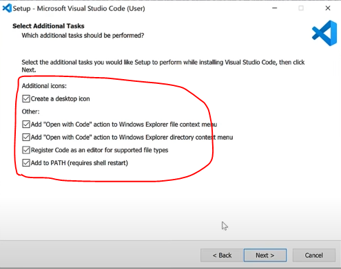

> aside negative
> The following few slides are just instructions for setting up C++ with VSCode. If you'd rather a video tutorial for this, here are some good resources

Video instructions for Windows:
[https://www.youtube.com/watch?v=DMWD7wfhgNY&ab_channel=KennyYipCoding](https://www.youtube.com/watch?v=DMWD7wfhgNY&ab_channel=KennyYipCoding)

Video instructions for MacOS:
[https://www.youtube.com/watch?v=tdAD0WZjXrM&ab_channel=CodeWizard](https://www.youtube.com/watch?v=tdAD0WZjXrM&ab_channel=CodeWizard)

## Install A C++ Compiler (WINDOWS) 

Duration: 0:15:00

> aside negative
> If you're using macOS, go to the next page!

### Install MSYS2

We'll be using MSYS2 for our C++ compiler. Download the MinGW installer with [this](https://github.com/msys2/msys2-installer/releases/download/2024-12-08/msys2-x86_64-20241208.exe) link.

Open the installer, and run through the steps to set up your compiler.

> aside positive
> Note: MSYS2 will by default install into C:\msys64. Remember this for later!!!!! (if for some reason you change the folder, also remember where you installed it).

On every page, just click next without changing anything. On the final page, make sure the `Run MSYS2 now.` box is checked, and press `Finish`. This will open up the MSYS2 shell.

### Install MinGW Toolchain

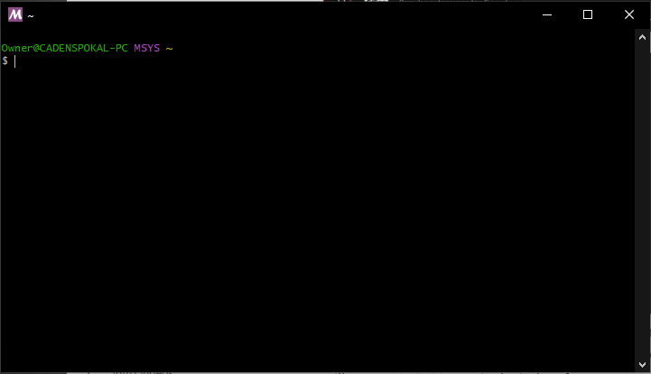

> aside negative
> If the shell doesn't open, or you closed it or something, just go to the Windows search bar and search for `MSYS2`, and run the app.

In this terminal, install the MinGW-w64 toolchain by running the following command:

``` Arch Linux
pacman -S --needed base-devel mingw-w64-ucrt-x86_64-toolchain
```

Press enter. The terminal will ask you for a download selection. Download everything, by just pressing `Enter`.

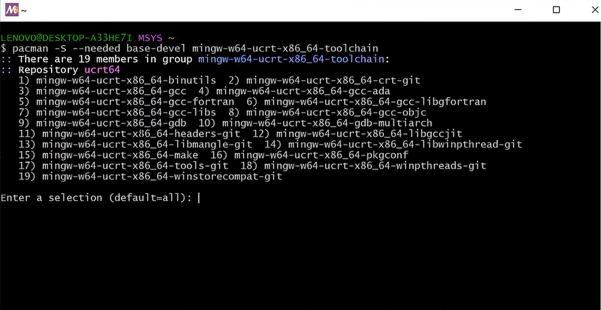

When asked to proceed with the installation, type `Y`, then press `Enter`.

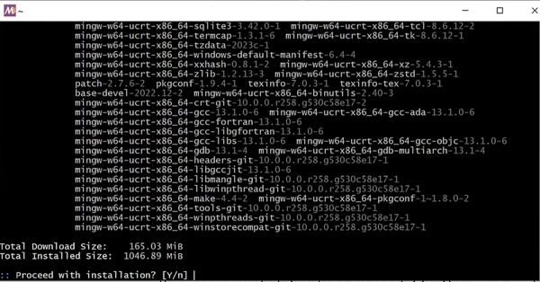

Once the installation is completed, you may exit the MSYS2 window.

### Add MinGW to enviroment variables

For everything to work, we need to make the C++ compiler an "enviroment variable". Go to the Windows search bar, and look for "environment variables", and open the first option.

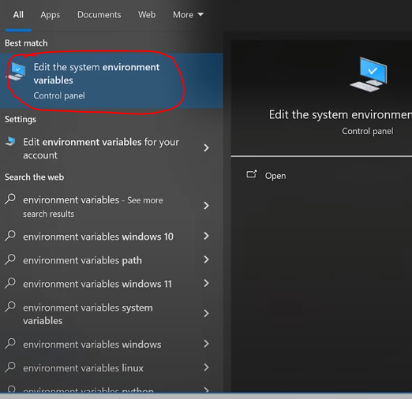

From here, click "Environment Variables".

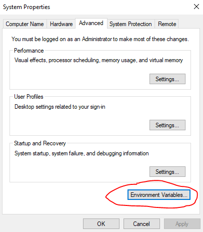

Then in the top box, click "Path", then click "Edit".

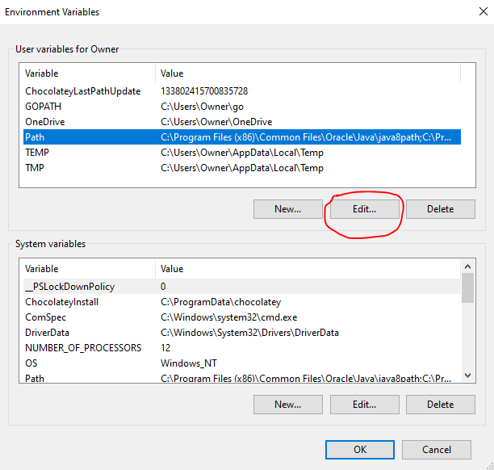

You want to add the following directory to your path:

``` Directory
C:\msys64\ucrt64\bin
```

> aside negative
> If you changed the installation folder when installing MSYS2, replace the `C:\msys64` with whatever folder you installed MSYS2 in. Leave the `\ucrt64\bin` at the end of the directory.

To add to path, press "New", then paste in that directory, and press "Enter".

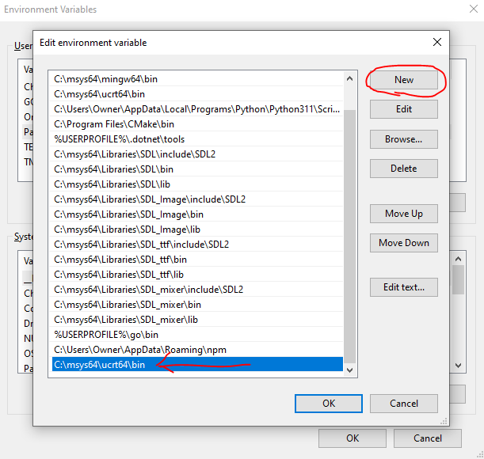

Press "Ok", then exit the environment variables window.

* If for some reason you don't have a "Path" variable in the top box, press "New", then enter "Path" for the `Variable name`, and paste the directory for the `Variable value`, the click "Ok".

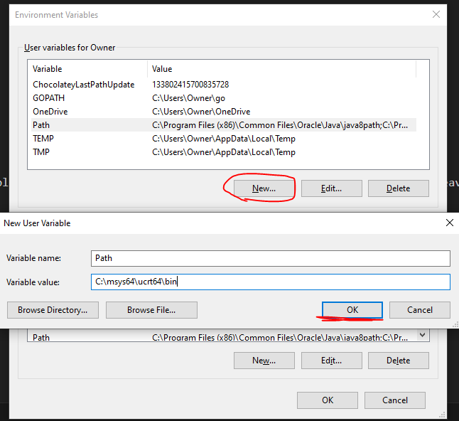

### Checking Installation

Let's confirm everything installed correctly by checking that compiler commands work. Open up a command prompt from the windows menu.

> aside positive
> You could also do this in the VSCode terminal if you wanted. It's just VSCode terminal can sometimes be weird for no reason, command prompt is more reliable. 

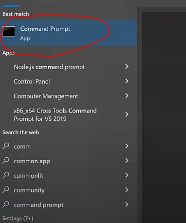

To check if the compilers are all working, run these commands one at a time in the terminal:

``` cmd
gcc --version
g++ --version
gdb --version
```

The output should look something like this:

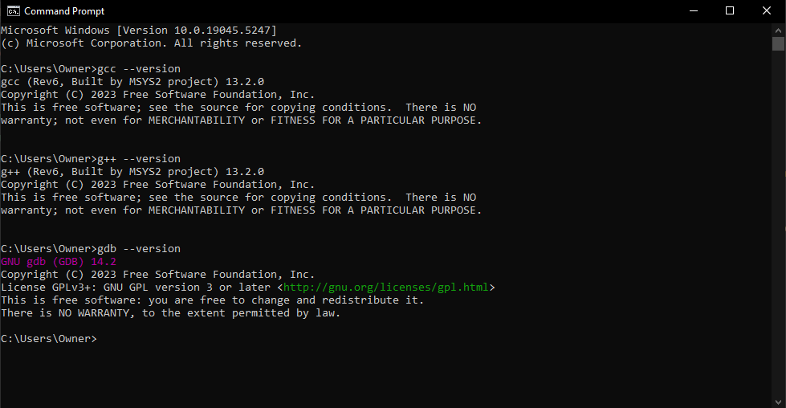

> aside positive
> The actual version numbers and stuff don't really matter. We're just checking to make sure the commands actually work.

If you get some kind of error for the output, make sure everything was installed correctly. Go back and make sure `C:\msys64\ucrt64\bin` was added to the "Path" system environment variable, then try again.

## Install A C++ Compiler (MAC)

Duration: 0:03:00

> aside negative
> If you're on Windows, don't worry about this!

### Install Clang through terminal

Press `Cmd+Space`, look for "terminal", and open the terminal app. Let's start by checking if clang has already been set up. Run this command in the terminal:

``` Clang
clang --version
```

If clang has already been set up, you should get an output like this:

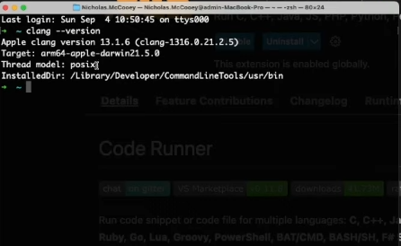

If you get get an error of some kind, then you have to install the xcode command line tools. To do this, run this command:

``` cmd
xcode-select --install
```

After this finishes, run `clang --version` again, to make sure it works

> aside  positive
> The actual version number shouldn't matter too much, we're just making sure the command actually works.

> aside negative
> I do not own a MacOS device. I have tried my best to provide functionality for Mac based on information found online, but without the ability to test this myself, I cannot on my own confirm the instructions in this tutorial are foolproof. If there is some error, I would reccomend contacting me to see what changes need to be made.

## VSCode Extensions and Compilation Check

Duration: 0:07:00

### VSCode extensions for C++

> aside positive
> In this step we're setting up the extensions to allow VSCode to edit C++ code. If you're using an environment other than VSCode, please perform whatever additional setup is required for your environment.

Open up VSCode. Go to the "Extensions" page on the right. In the search bar, type "C++", and install this extension:

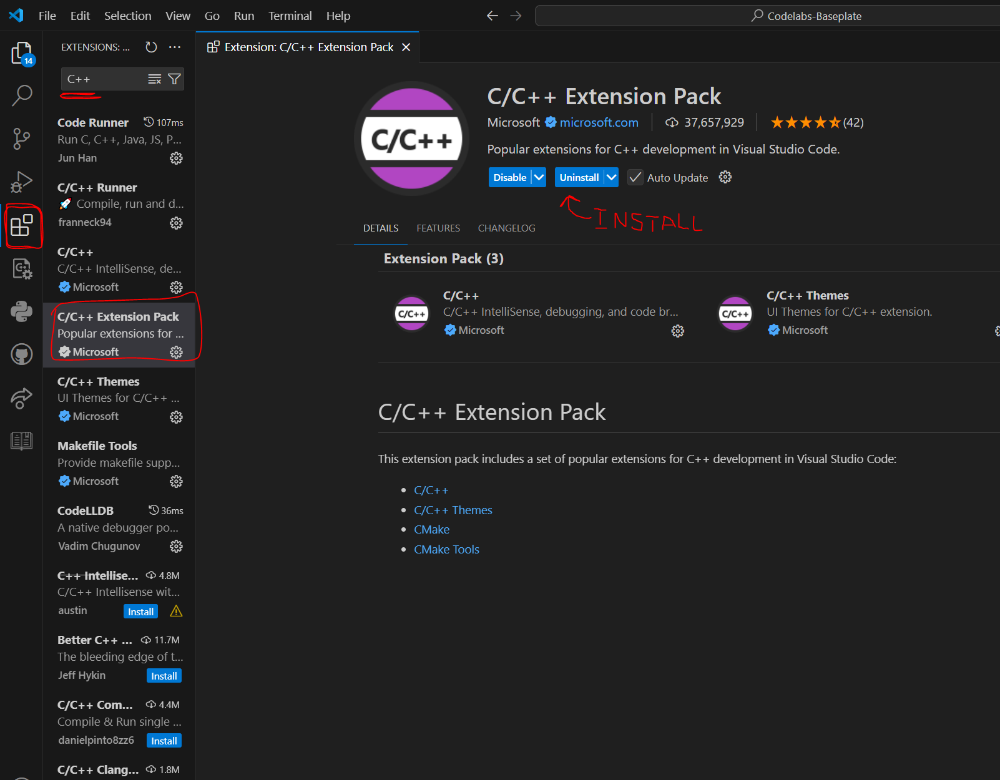

Also make sure to install this "Code Runner" extension:

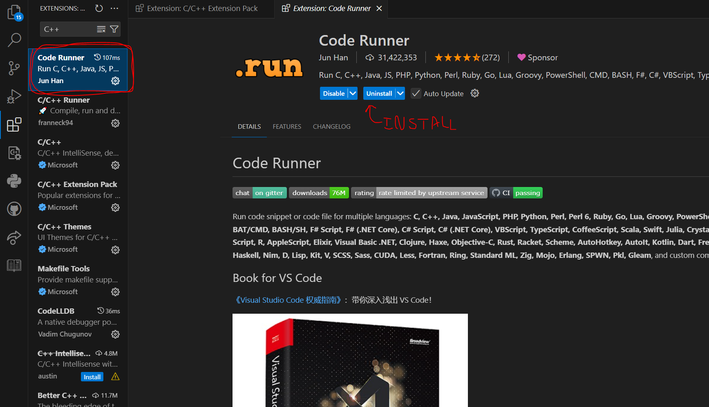

> aside negative
> Note: These will not be the last extensions we install in this tutorial.

### Testing C++

> aside positive
> The good news is this is the only programming I'm gonna ask you guys to do. We just need to make sure you'll be able to compile my code later on :)

In the top left corner of VSCode, select `File->New Text File`. In the editor, click, "Select a Language", Then choose "C++"

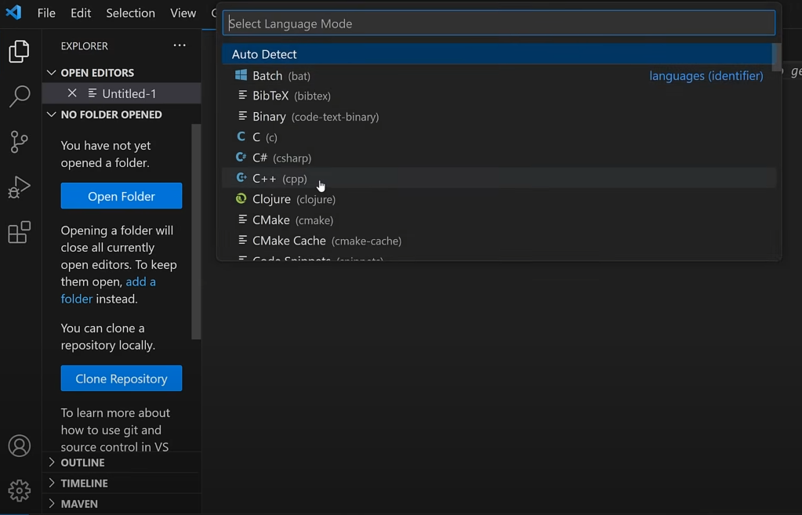

Before making any edits, go to `File->Save As`, and save the new file wherever you want (we're gonna delete it when we're done anyways). Name the file "test" (or whatever you want).

Now go to the editor, and just paste this code:

``` C++
#include <iostream>

int main() {
    std::cout << "Hello World!\n";
    return 0;
}
```

Now save the changes, and in the top right, there should be a little play button with a drop down arrow. Press the drop down arrow, and choose "Run Code". If a list of compilers pops up, choose the "g++.exe" option (it'll probably be the first option). If you're on Mac, this will probably be a "clang" option, instead.

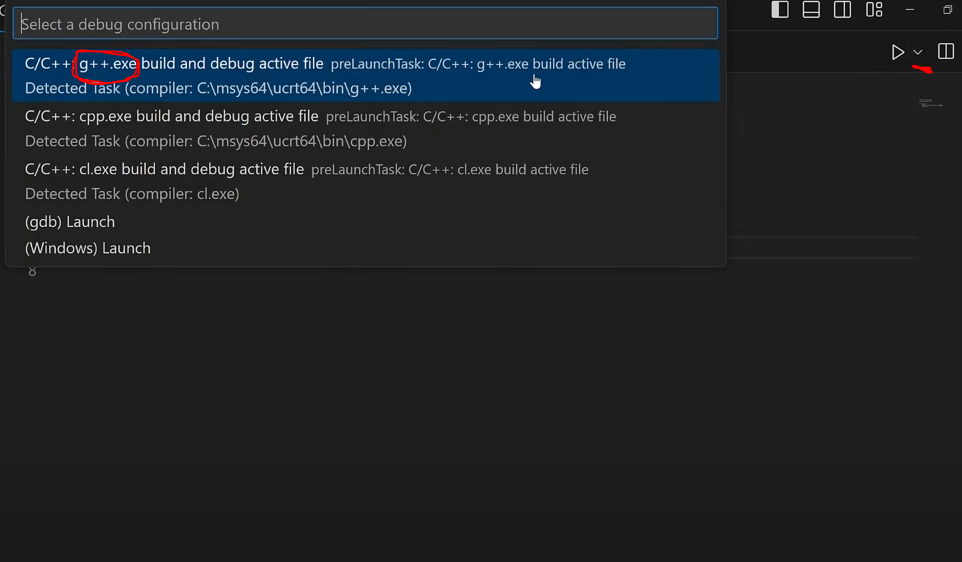

> aside negative
> If you don't see the "Run Code" option, choose "Run C/C++ file". It's just sometimes this option will show a bunch of debug information that we don't really care about right now. You should still find "Hello World!" (it may be in the Output or Debug Console tab though, or you can just try running it again).

If everything ran correctly, you can go ahead and delete these test files. 

### Error Handling

If the code doesn't print "Hello World", look at the error message in the terminal. If you're getting some kind of undefined reference error, there is an issue with your installation of the C standard library. Ensure you properly installed the MinGW toolkit, and added it to your environment variables. This could also be caused by using the "gcc" compiler for the C++ file, ensure you chose the "g++.exe" compiler option (clang on mac). 

If there is an error along the lines of "g++ is not recognized", there is likely an issue with the installation of the compiler. Ensure all installation steps in this tutorial were follwed correctly. Sometimes, the VSCode terminal can throw errors that the Command Prompt won't. Open the command promp and test to see if the `g++ --version` command throws an error (`clang --version` for mac). If it doesn't, then it's probably VSCode that's messed up. Try `alf+f4`ing VSCode, then reopening it and trying again.

## Setting up CMake

Duration: 0:20:00

CMake is the tool we'll use to make building the project quick and easy. To get it, first download the CMake installer at [this site](https://cmake.org/download/), under "Binary Distributions". 

In my experience, this is one of the most frustrating parts of this process, so please feel free to reach out!

> aside positive
> Be sure to download the right version for your computer. Mac users download the .dmg installer, and Windows users the .msi installer.

> aside negative
> FOR WINDOWS USERS: CMake should automatically add itself to the system's PATH environment variable. If for some reason it doesn't, this will cause issues later. If you want to check now, just go to "edit the system environment variables -> Environment Variables -> Path -> Edit", and check that `C:\Program Files\CMake\bin` is present. If it isn't you should add it. (Note: if you changed CMake's install location, `C:\Program Files` may be different).

### Confirm Installation

To confirm you've successfully installed CMake, open the command terminal, and type this command:

``` cmd
cmake --version
```

You should get this output:

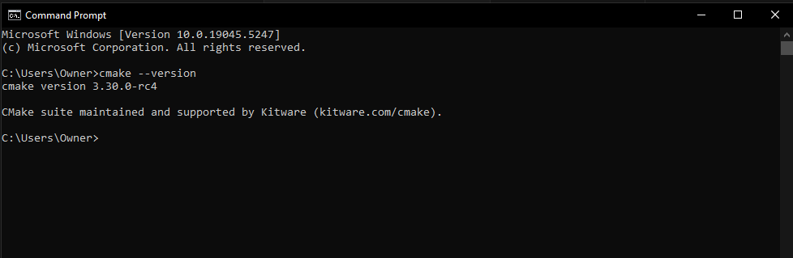

> aside positive
> This could also be run from the VSCode terminal, but again, the VSCode terminal can sometimes throw errors for no reason.

Like before, the actual version number doesn't really matter, we're just making sure the command works. If it doesn't, ensure you downloaded the right installer for your computer from the website. Windows users, ensure cmake actually added it to the system's Path environment variables. 

### CMake Tools Extension

Let's add another VSCode extension so we can develop with CMake. Install the "CMake Tools" extension:

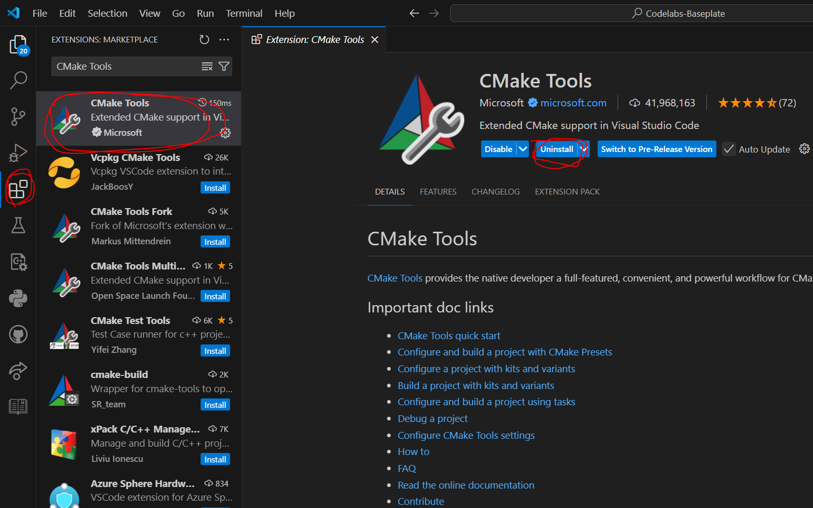

[Here](https://www.youtube.com/watch?v=_BWU5mWqVA4&ab_channel=VisualStudioCode) is a link to a good video resource for setting up CMake. Skip to `1:26` for the installation steps.

### Testing CMake

With everything installed, let's test an actual CMake build. Instead of making you actually code anything, just download [this](https://drive.google.com/uc?export=download&id=1PwXVAFgfhf8LnbfV1VGspMr4_zal9n0b) .zip file to test with. Extract the folder anywhere, then open it in VSCode. Your VSCode should look like this:

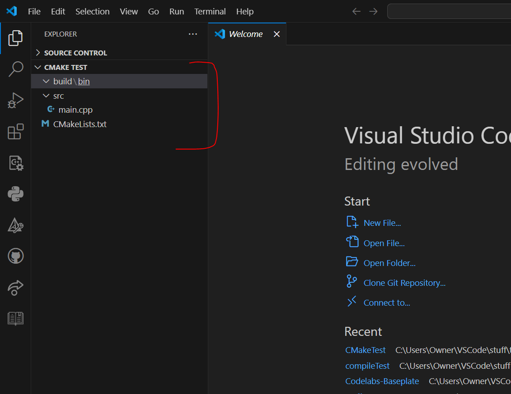

At the top of the window, click on the bar that says "CMake Test", then select "Show and Run Commands". Type "CMake: Select a Kit", and press enter. Select "Scan for kits". Once it's done, click on the bar again, select "Show and Run Commands" again, and select "CMake: Select a Kit" again.

* Sorry for poor image quality here :(

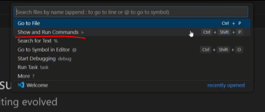

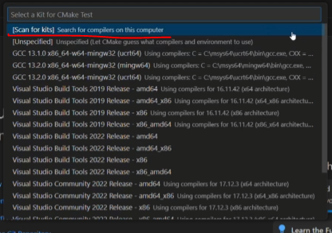

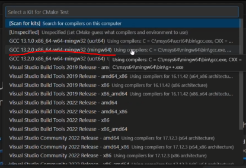

> aside negative
> There will probably only be one locally installed option below `[unspecified]`. This option represents the compiler we installed earlier. If there are multiple options, select the desired compiler (if you're not sure which, you can always guess and check c:). Windows users choose the `mingw` option, if it's available. We only want to use locally installed compilers, so don't pick any of the options that say "Visual Studio Build Tools" or anything like that.

On the terminal at the bottom of the screen, click on the "TERMINAL" tab to start entering commands.

Now, in the terminal, type these four commands one at a time:

``` cmd
cd build
cmake ..
cmake --build
./bin\test.exe
```

The output should say "Hello World!", like this:

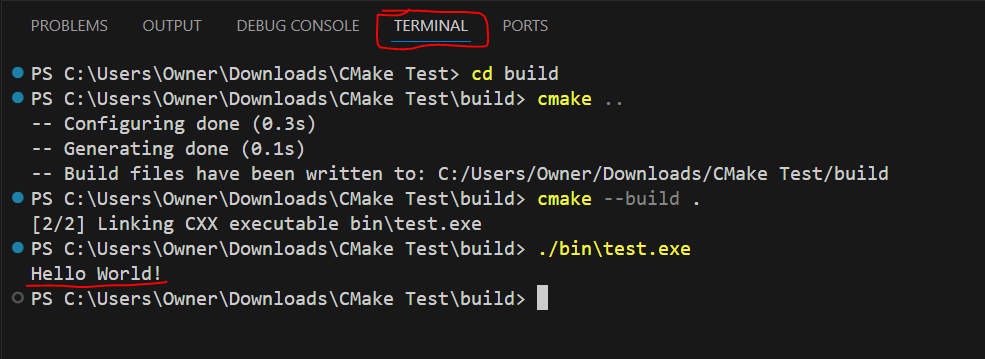

If the output fails, and this doesn't happen, make sure the correct kit was selected in the last step. If the terminal says something like "cmake is not a recognized command", ensure `cmake --version` works in the command prompt terminal, and try `alt+f4`ing VSCode and retrying the process. Also ensure you are sunning the final three commands from the "build" folder.

> aside positive
> Don't worry, building won't be this complicated from here on out. For the actual project there's a task that automates this whole process with one button press, so you won't have to enter any commands :)

## Setting up git (OPTIONAL)

This page is a WIP

git is optional for this tutorial, but is strongly reccomended for development in general.

## Setting Up SDL

Duration: 0:20:00

### Installation

Simple Directmedia Layer (SDL) is the graphics rendering API that the engine uses to render images and play sounds. We're actually going to install four libraries in order to build this project. Below are the libraries, and links to their download pages.

1. [SDL](https://github.com/libsdl-org/SDL/releases/tag/release-2.30.11) - The main rendering API
2. [SDL_image](https://github.com/libsdl-org/SDL_image/releases/tag/release-2.8.4) - Used for loading images from file
3. [SDL_ttf](https://github.com/libsdl-org/SDL_ttf/releases/tag/release-2.24.0) - Used for rendering text
4. [SDL_mixer](https://github.com/libsdl-org/SDL_mixer/releases/tag/release-2.8.0) - Used for playing audio

On these download pages, there will be a bunch of different installation options. Choose the installation option fit for your computer architecture. For development, I reccomend choosing one of the .zip files containing "devel". In this tutorial, I installed the `SDL2-devel-2.30.11-mingw.zip` option.

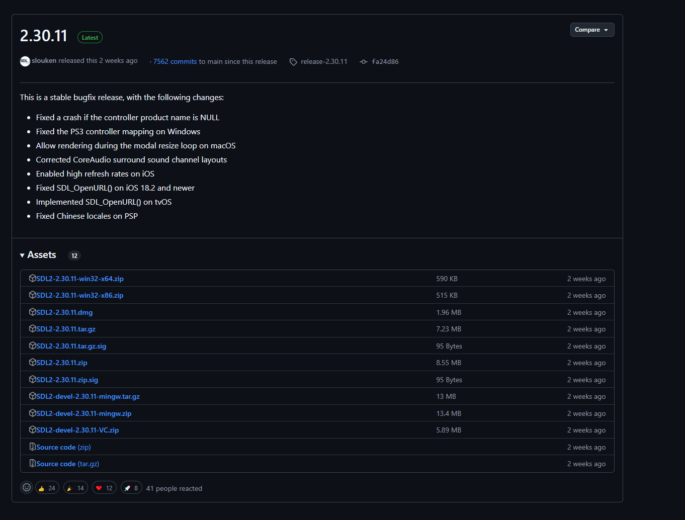

### File Management

Create a folder for libraries, called `Libraries`, anywhere on your computer (Note: if you already have a dedicated folder for programming libraries, you may use that one). This is where we will store the SDL libraries. I put this folder in `C:\msys64\`, for convenience, but it could go anywhere.

Once you have downloaded and extracted all of the SDL library zip files, open the extracted folder for SDL2, and go into `SDL2-2.30.11`.

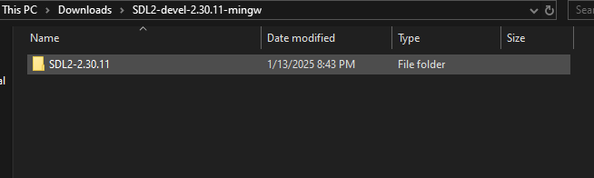

In this folder, there will be a couple of folders. Select the correct folder for your system architecture. In this tutorial, I chose `i686-w64-mingw32`. Take this folder, and move it into your `Libraries` folder.

> aside positive
> If you chose the VC option, or some other option without these folders, this step won't apply, just select the base `SDL2-2.30.11` folder, and move that into your `Libraries` folder.

I'd reccomend renaming the folder you moved to `SDL`, since it will make organisation easier later.


Repeat this process for the other three SDL libraries you installed. Name the moved folders `SDL_image`, `SDL_ttf`, and `SDL_mixer` respectively.

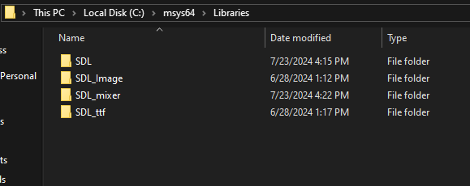

### Adding Environment Variables (WINDOWS)

> aside negative
> Mac users, skip to the next subtitle!

In each of the folders you moved into your `Libraries` folder, there will be a `bin` folder. This is the directory that you will need to add to your system's Path environment variabele.

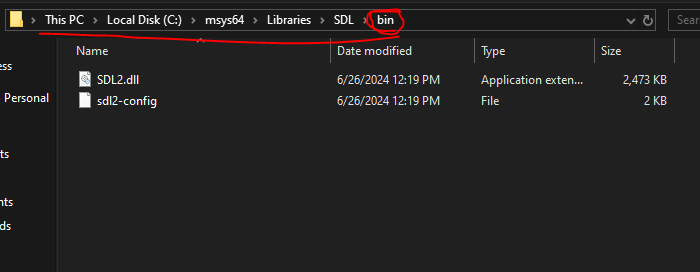

In the Windows search bar, look for and open "Edit the system environment variables". Press `Environment Variables`, then in the top box, click `Path`, then press `Edit`, then click `New`.

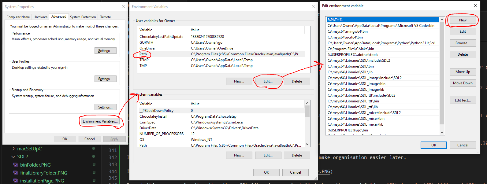

As mentioned before, each of the SDL libraries will have a `bin` subfolder. Add all four of these directories to the Path.

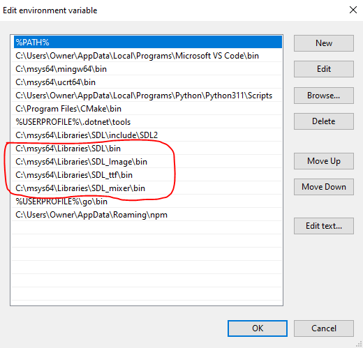

Press "Ok", and exit the environment variable editor.

## Testing Build Flow

Duration: 1:00:00

With everything installed and set up, we should theoretically be done. Of course, we'll have to test to make sure that everything links and builds correctly. start by cloning this SDL baseplate project.

> aside negative
> We'll use git to make installing easy. If you don't have git set up, you can just download the baseplate from [here](https://github.com/bustlingbungus/SDL2_Boilerplate) (press "Code->Download ZIP" then open the folder in VSCode).

We're using this simpler SDL boilerplate because it'll be easier to debug if something goes wrong. Clone the baseplate into any folder by running this command from said folder:

``` bash
git clone https://github.com/bustlingbungus/SDL2_Boilerplate.git
```

> aside positive 
> If you have SSH keys set up with Github, it's reccomended to go to the repository and clone using the SSH option instead.

### Edit CMakeLists.txt (WINDOWS)

> aside positive
> Mac users shouldn't have to worry about this step. Go to the `Building Project` subtitle.

Go to `CMakeLists.txt`. In the section near the top where you see string directories, these need to be changed to where ever you stored SDL libraries on your computer. On line `10`, se the string to the directory of your `Libraries` folder, where you're keeping the SDL libraries. For the next four lines, just make sure the main folder names are the same as yours. I.e., line 12 has "${...}/`SDL_Image`/...", so ensure your library folder containing SDL_image is called `SDL_Image`.

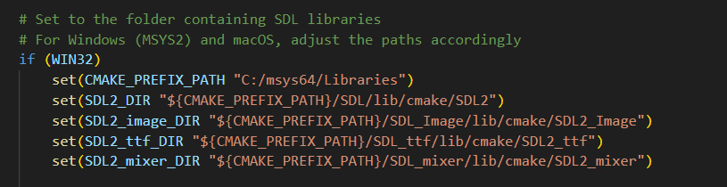

### Building Project

Now enter this folder you created in VSCode. Select the appropriate CMake kit, as we did on page 7. Run these five commands in the VSCode terminal (also like we did on page 7).

``` cmd
cd build
cmake ..
cmake --build .
cd bin
./project.exe
```

You should see a window open, like this:

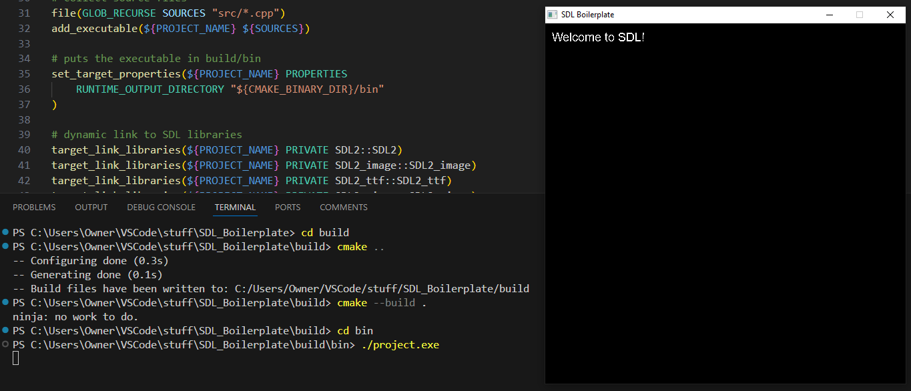

If you get a result like this, you're good to go! You shouldn't need to do any more setup. If you successfully build this project, you should have no trouble building any of my other SDL projects. 

If you get an error, ensure all the steps were followed correctly. Ensure all SDL include directories are included in your include path. Windows users, ensure SDL bin directories are in the environment path. Ensure the SDL library files you installed form the website is the correct version to install for your computer.

### Build Automation

As mentioned earlier, this build process will be automated with the press of a button. Included in the repository is `.vscode/tasks.json`. You don't need to edit this at all, it's just the file that tells VSCode to run all the commands you just did. On VSCode, press `Ctrl+Shift+B` this should build the project automatically, and you'll get the same result as before. Way more convenient than typing a bunch of terminal commands!

> aside negative
> If you use an environment other than VSCode, these build tasks probably won't be very helpful. I'd reccomend seeing if you're environment supports build automation like this, since it really helps in speeding up the development process.

## Conclusion


If you successfully build the project on the last slide, then you should now be able to build any SDL project easily using CMake. The hard part is over, you can now get to actual development. 

Congrats on making it through, I know setting things like this up with C++ can be an absolute nightmare.
