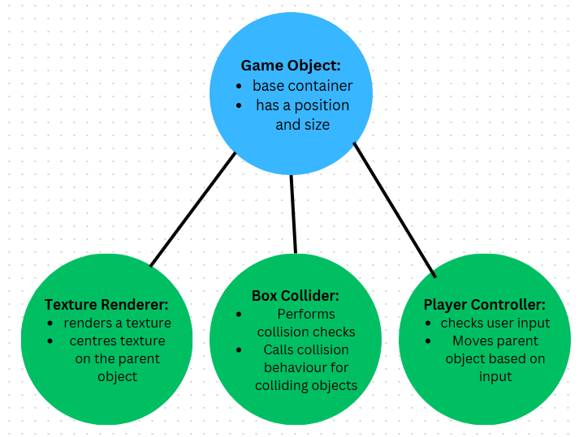
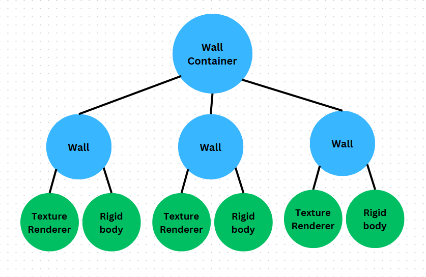
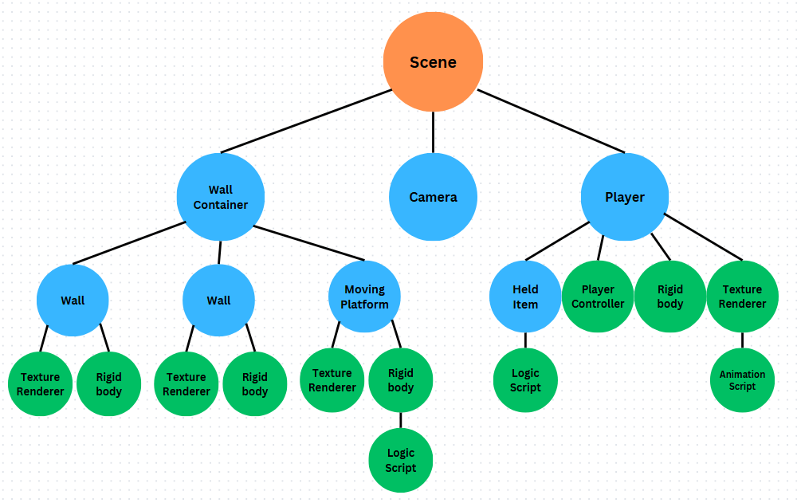
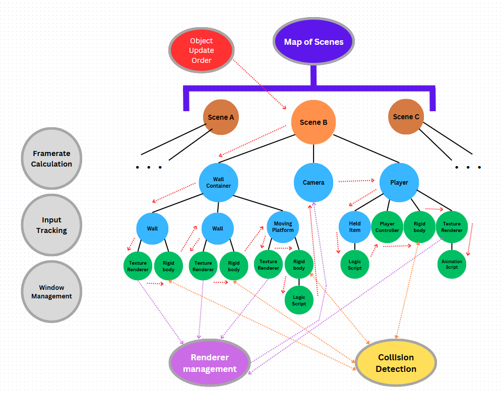
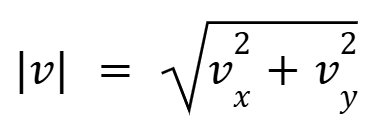

author: Caden Spokas
summary:
id: EngineDocumentation
tags:
categories:
environments: Web
status: Published
feedback link: https://github.com/bustlingbungus/Codelabs-Baseplate/tree/Engine_Build_Instructions

# Bungus Engine Documentation

## Overview

### Table of Contents

1. Overview (this page)

## Engine Visualisation

### The Game as a Tree

Each object in this engine can be viewed as the root of a tree structure. Every game object can have an arbitrary number of child objects (including none). Game objects contain an array of pointers to other game objects, their `components`. These components can do a number of things, they might reder a texture, perform collisoin checks, move their parent object around, etc. 



Importantly, these object components are also just game objects themselves. They're just specialised objects that contain a reference to their parent, which allows them to track and modify their parent in a specific way. 

It's not just specialised components that have to be shild objects, though. For organisational purposes, as well as code optimisation, regular game objects can be stored as children of another game object.



This begs the question, how do we store and manage the base container game objects with no parents? To do this, we give all these parentless objects one parent game object: the scene itself. A scene in this engine is really just a game object, intended to be the root of the game object tree. Hence, the entire game can be thought of as a big tree structure, where each node is a game object, and a node's children are its components. 

Each game object and component needs to be updated every frame. To do this, starting at the root scene, The object is updated, then all of it's children are updated, recursively. In other words, game objects are updated in `preorder` traversal.



Natually, you might wonder if anything could connect multiple scene nodes. Since these scens serve as root nodes, they are not connected like other game objects, though the game will store a hashmap of these scenes, in order to have an arbitrary number of trees, or scenes, in the game. Switching between scenes, therefore, is simply a matter of switching the root node that gets updated every frame.

### Global Management

> aside negative
> There are some systems that involve objects referencing objects that they are neither a parent nor child of. The two main examples of this are texture rendering and collision checks, both of which will be described more in depth later. 

In order for `TextureRenderer` components to be rendered by a camera object, when a camera is updated, it will iterate through every `TextureRenderer` component and render it relative to itself. In order to find these texture renderrs, rather than traverse through the scene tree in search, there is a global array that stores a reference to all `TextureRenderer` components. This way, cameras can quickly render without having to first search. 

Likewise, in order to determine collision, `BoxCollider` components need to check all other box collider components. So, rather than have to traverse the scene tree in search, there is a global array for managing references to all `BoxCollider` components. 

There are also some systems that are not necessarily relevant to to the scene's tree structure. For instance, collecting user input, and calculating framerate are handled outside of the game's scenes, though they may be accessed by objects within the game. Here is a more comprehensive map of what a game in this engine might look like: 



## Creating Custom Game Objects and Components

### Creating a Subclass

Any and all of the standard objects types in the API can be used as a template by just creating a subclass of said object. The main two baseplate game obects for this purpose will be `GameObject` itself, and `ObjectComponent`s.

> aside negative
> In order for a custom object to be useable, the constructor and deconstrucor functions <i>must</i> be defined. 

``` C++
/* MyObject.hpp */
#pragma once
#include "engine/BungusEngine.hpp"

class MyObject : public GameObject
{
    public:

        MyObject(Vector2 pos, Vector2 size, float speed);
        ~MyObject();

        virtual void Destroy();

        virtual void AssignComponents(shared_ptr<GameObject> self);
        virtual void Update();

    private:

        float speed;
};
```

``` C++
/* MyComponent.hpp */
#pragma once
#include "engine/BungusEngine.hpp"
using namespace std;

class MyComponent : public ObjectComponent
{
    public:

        MyComponent(shared_ptr<GameObject> parent);
        ~MyComponent();

        virtual void Destroy();

        virtual void Update();

    private:

        // EXAMPLE: stores a reference to parent's rigidbody component
        shared_ptr<Rigidbody> parent_rigid;
};
```

> aside positive
> Let's talk about the functions that are being redefined in the above examples:

<b>Constructor/Destructor:</b>

These are just part standard C++ subclass definitions. The main things to mention are, for the constructor, any arguments you like may be used, so long as you fill out the base class' constructor args. Importantly, in the destructor function, it is standard in this engine for the destructory to <i>only</i> call `Destroy()`, nothing more and nothing less.

``` C++
/* MyObject.cpp */

// constructor
MyObject::MyObject(Vector2 pos, Vector2 size, float speed)
: GameObject(pos, size), speed(speed)
{}

// destructor
MyObject::~MyObject() { Destroy(); }
```

``` C++
/* MyComponent.cpp */

// constructor
MyComponent::MyComponent(shared_ptr<GameObject> parent)
: ObjectComponent(parent)
{
    // EXAMPLE: stores a reference to parent's rigidbody component
    parent_rigid = parent->GetComponent<Rigidbody>();
}

// destructor
MyComponent::~MyComponent() { Destroy(); }
```

<b>Destroy</b>

This is the main function used for resource deallocation, and should be used as though it is the deconstructor. Importantly, within the Destroy function, you must call the base class' `Destroy()` function, because the base definitions for `Destroy` handle important resource management for game objects.

``` C++
/* MyObject.cpp */

// no additional cleanup required
void MyObject::Destroy() {
    GameObject::Destroy();  // make sure to call base's destroy
}
```

``` C++
/* MyComponent.cpp */

void MyComponent::Destroy() {
    ObjectComponent::Component();
    parent_rigid = nullptr; // additional cleanup required
}
```

<b>AssignComponents</b>

There are a few ways to add a component to a game object. You can just call `obj->AddComponent<Type>(...)`, though there also exist methods to add given components on instantiation. i.e., you can give an object specific components from the moment it's created. This is done in the `AssignComponents` function. The argument to this function will be the object itself, but as a shared pointer. This is done because object components rely on shared pointers, and aren't compatible with the `this` raw pointer accessible from within a class. 

Within `AssignComponents`, use `AddComponent` to add a given component to the object itself.

``` C++
/* MyObject.cpp */
#include "MyComponent.hpp"

// EXAMPLE: give self a rigidbody, texture renderer, and `MyComponent`
void MyObject::AssignComponents(shared_ptr<GameObject> self)
{
    // create a texture for texture renderer
    auto tex = make_shared<LTexture>(gWindow); // textures are made with reference to the global window
    tex->solidColour({255,255,255,255});
    // add texture renderer component
    AddComponent<TextureRenderer>(self, tex);

    // add rigidbody component. rigidbodies automatically add a box collider as well
    AddComponent<Rigidbody>(self, 1, 0.05);

    // add custom object component
    AddComponent<MyComponent>(self);
}
```

> aside positive
> `AssignComponents(self)` is called automatically on an object when it is instantiated, so you do not need to call this function manually.\

<b>Update</b>

This is the main behaviour function that will be called once per frame. If you want an object to have some special code that executes every frame, it should be put in `Update`.

``` C++
/* MyObject.cpp */

void MyObject::Update() {
    // example update
    position *= speed * gTime.deltaTime(); 
}
```

``` C++
/* MyComponent.cpp */

void MyComponent::Update() {
    // EXAMPLE: kill parent velocity
    parent->rigid->SetVelocity(Vector2_Zero);
}
```

### Adding Objects Into the Game

> aside negative
> there will also be some more complicated ways to add objects when defining custom scenes, which will be discussed later.

The `Instantiate` function will instantiate the desired game object type into the scene. The arguments of `Instantiate` vary, it takes the arguments used in the constructor of the object being created. For instance, in this example we Instantiate a `MyObject`, so the function will take a Vector2, a Vector2, then a float. Due to technical limitations, there are not dynamic tooltips to show the arguments of Instantiate, so it important to consult the class constructor of whatever object you are trying to create.

> aside negative
> WARNING: using arguments that are not suitable for the constructor of the object type will result in a crash!

Instantiate will create a new game object with the arguments provided, and add it into the current scene by adding the object as a child node of the current scene. The function also returns the shared pointer to the object created.

``` C++
/* in main.cpp (or anywhere really) */

// adds a MyObject into the game
// stores it pointer to obj
auto obj = Instantiate<MyObject>(
    Vector2_Zero, 
    Vector2(50, 75),
    400.0f
);
```

## SDL Documentation + gWindow

[Here](https://bustlingbungus.github.io/SDLBoilerplateDocumentation/) you can find full documentation for the SDL methods used in this boilerplate.

### gWindow

This is the global window object used for all window related functions in the engine. Do not create any additional LWindow objects. When creating LTextures (or any function involving a window), use gWindow. gWindow's default window dimensions are 1280x720 pixels, and is in windowed mode by default.

### SetWindowTitle

This function modifies gWindow's title to any string.

<b>Returns:</b> void

<b>Arguments:</b>

* `title : std::string` - The new title for the window.

## Input Tracking

Input from keyboard keys and mouse buttons are tracked in three hash sets, "down", "held", and "up". On the frame that an input is pressed, it is put into the "down" and "held" sets. On the next frame it is removed from the "down" set, but not neccesarily from "held". On the frame an input is released, it is released, it is added to the "up" set, and removed from the "held" set. It is removed from "up" on the next frame. In other words "up" and "down" sets are cleared once per frame.

Mouse position is stored in a `Vector2Int` window position coordinate.

The global input tracker by default collects input in the event loop of the main window frame. For accurate input reading, this should not be changed.

> aside positive
> * "Down" refers to inputs that were pressed on the current frame.
> * "Held" refers to any input that is currently held down.
> * "Up" refers to inputs that were released on the current frame.

> aside negative
> The three input functions take an `int` argument, but SDL keyboard inputs are stored as `SDL_KeyCode`s. When checking keyboard input, just typecast these keycodes to an `int`.

### <b>Input Functions</b>

### InputDown

Checks if the queried input was pressed down on the <b><i>current</i></b> frame.

<b>Returns:</b> bool

<b>Arguments:</b>

* `input : int` - The input being queried. 

### InputUp

Checks if the queried input was released on the <b><i>current</i></b> frame.

<b>Returns:</b> bool

<b>Arguments:</b>

* `input : int` - The input being queried. 

### InputHeld

Returns true on <b><i>any</i></b> frame that the queried input is held down.

<b>Returns:</b> bool

<b>Arguments:</b>

* `input : int` - The input being queried. 

### MouseWindowPosition

Returns the x,y pixel coordinates of the mouse within the window.

<b>Returns:</b> Vector2Int

### MousePosition

Returns the position of the mouse in game. Does this by finding the mouse's position on the window, added to the origin of a camera.

<b>Returns:</b> Vector2

<b>Arguments:</b>

* `cam : std::shared_ptr&lt;Camera&gt;` - The camera used to find the position in game. Leave as `nullptr` to automatically find a camera. 

<b>Other Notes:</b>

* If `cam` is `nullptr`, and no camera exists in the scene, the mouse's position on the window is returned.

## Time Tracking

This is the system that calculate's the game's framerate, and delta time (the time elapsed between frames). All time tracking functions are stored in the global `gTime` object. To access these functions, call `gTime.deltaTime()`, for instance. 

`gTime.findDeltaTime()` is called in the main window loop. To ensure accurate tracking, this should not be moved, or called elsewhere.

Time tracking is based off of differences in `clock_t` objects, from the standard `ctime` header. This method is only accurate to 1ms. In other words, delta time (time elapsed between frames), may only be an integer number of milliseconds, which is to say may only have up to three decimal digits in seconds. This mean that the FPS may only be the inverse of an integer number of milliseconds. For instance, it is impossible to have 60 FPS, because 60 FPS would mean 16.666... milliseconds between frames, which isn't an integer. It is possible to have 62.5 FPS, since this means 16 milliseconds between frames, which is an integer. 

### <b>Public Time Functions</b>

### setMaxFramerate

Sets the framerate limit for the application. Set to `-1` for uncapped framerate.

<b>Returns:</b> void

<b>Arguments:</b>

* `maxFramerate : int` - The FPS cap for the program. 

### Framerate

The current framerate (in FPS) of the application.

<b>Returns:</b> int

### deltaTime

The amount of time passed since the last frame (in seconds).

<b>Returns:</b> float

## Math Library Documentation

Bungus Engine contains a library for some mathematical methods, especially vector arithmetic. Here is documentation for these custom methods and structures.

### <b>Vector2/Vector2Int</b>

A 2 dimensional vector, containing x, and y members. `Vector2` has `float` components, while `Vector2Int` has `int` components. The only difference in methods for the two types are that `Vector2Int` does not have the `length`, `normalise`, or `normalised` methods.

### Methods:

<b>print</b>

Prints the vector's x and y components to console, using `std::cout`. Components are printed x, then y, tab seperated, ending with newline.

Returns: <i>void</i>

<b>length</b>

Returns the magnitude of the vector, as per the formula for vector magnitude:



Returns: <i>float</i>

<b>normalise</b>

Makes the vector into a unit vector, pointing in the same direction as the original vector, by dividing x and y by the vector's magnitude. If the vector is `(0,0)`, this does nothing. 

Returns: <i>void</i>

<b>normalised</b>

Returns the vector as a unit vector, pointing in the same direction as itself. If the vector is `(0,0)`, returns `(0,0)`.

Returns: <i>Vector2</i>

### Operator Overloads

* `* : (Vector2/Vector2Int)`: Returns the dot product of the two vectors (float/int).
* `& : (Vector2/Vector2Int)`: Returns the hadamard product of the two vectors (Vector2/Vector2Int).
* `&= : (Vector2/Vector2Int)`: Makes self the hadamard product of itself and the other vector (void).
* `| : (Vector2/Vector2Int)`: "Hadamard division", Returns the hadamard product of itself and the vector whose components are the inverse of the other operand (Vector2/Vector2Int)
* `|= : (Vector2/Vector2Int)`: Makes self the "Hadamard division" result of itself and the other vector (void).
* `^ : (Vector2/Vector2Int)`: Returns the cross product of the two vectors (float/int).
* `* : (float)`: Returns the scalar product of the vector and the k (Vector2/Vector2Int).
* `*= : (float)`: Makes self the scalar product of itself and k (void).
* `/ : (float)`: Returns the scalar product of the vector and the inverse of k, scalar division (Vector2/Vector2Int).
* `/= : (float)`: Makes self the scalr division product of itself and k (void).
* `+ : (Vector2/Vector2Int)`: Returns the vector whose components are the sum of the two operands (Vector2/Vector2Int).
* `+= : (Vector2/Vector2Int)`: Makes self the vector sum of itself and the other vector (void).
* `- : (Vector2/Vector2Int)`: Returns the vector whose components are the left operand's components minus the right's components (Vector2/Vector2Int).
* `-= : (Vector2/Vector2Int)`: Makes itself the result of subtracting the other vector from itself (void).
* `== : (Vector2/Vector2Int)`: Returns `true` if and only if both components are equal to the other vector components (bool).
* `!= : (Vector2/Vector2Int)`: Returns `true` if either component is different from the other vector's corresponding component (bool).

### Global Constant Vectors

There are some globally accessible vectors that represent common vectors. They exists for both Vector2 and Vector2Int. They are:

> aside negative
> To get any of these as a Vector2Int, use `Vector2Int_...`, rather than `Vector2_...`.

* `Vector2_Zero` : (0, 0)
* `Vector2_One` : (1, 1)
* `Vector2_Up` : (0, 1)
* `Vector2_Down`: (0, -1)
* `Vector2_Left`: (-1, 0)
* `Vector2_Right`: (1, 0)

### <b>Mathematical Constants</b>

These are macro definitions for common mathematical constants. They are:

* `PI: 3.141592654f` - Ratio of a circle's circumference to it's diametre.
* `ROOT2: 1.414213562f` - The square root of two.
* `SIN45: 0.7071067812f` - sin/cos of 45°, or π/4 radians, or the sqrt(2)/2.
* `EULERS_NUMBER: 2.7182818285f` - The natural rate of change, e.

### <b>RectF</b>

A container for an x/y position, a width (w), and height (h), all floats. 

<b>area()</b>

Returns the width * the height.

### min

Returns the minimum value of the two variables. Return type will be the same as the argument types. The two arguments must be of the same type, and must have the `&lt;` operator defined. 

### max

Returns the maximum value of the two variables. Return type will be the same as the argument types. The two arguments must be of the same type, and must have the `&gt;` operator defined. 

### clamp (version 1)

Clamps a value x between a min and a max. Does not modify the x argument. If `x` is less than `min`, returns `min`. If `x` is greater than `max`, returns `max`. Otherwise, returns `x`.

Return type will be the same as the argument types. The two arguments must be of the same type, and must have the `&lt;` and `&gt;` operators defined. 

<b>Arguments:</b>

* `min` - The minimum return value.
* `max` - The maximum return value.
* `x` - The value being inspected.

<b>Other Notes:</b>

* It is not reccomended to use this function when min > max.

### clamp (version 2)

Clamps a value x between a min and a max. modifies the x argument, instead of returning it. If `x` is less than `min`, makes x `min`. If `x` is greater than `max`, makes x `max`. Otherwise, does not modify `x`.

The two arguments must be of the same type, and must have the `&lt;` and `&gt;` operators defined. 

<b>Arguments:</b>

* `min` - The minimum return value.
* `max` - The maximum return value.
* `x` - The modifiable value being clamped.

<b>Other Notes:</b>

* It is not reccomended to use this function when min > max.

### pow

Raises a value to the nth power via iterative multiplication. n must be an integer number, if n is negative will return the expected value.

Return type will be the same type as the `x` parameter. The type must be castable from double, and must have the `&lt`, `*=`, and `/` operators defined. 

<b>ArgumentsL</b>

* `x` - The number to raise to the nth power.
* `n : int` - The power to raise `x` to.

<b>Other Notes:</b>

* If x is an integer and `n &lt; 0`, 0 will be returned.
* O(n) time complexity

### abs

If the argument is less than 0, returns it as a positive value of equal magnitude. Otherwise returns the input. 

Return type will be the same as the argument's type.

### ceil

Returns an input value rounded up to the nearest integer. 

Return type will be the same as the input's type.

### ceilToInt

Returns an input value rounded up to the nearest integer, typecasted to an `int`.

### floor

Returns the input rounded down to the nearest integer.

Return type will be the same as the input's type.

### floorToInt

Returns an input value rounded down to the nearest integer, typecasted to an `int`.

### sign

Returns the sign (negative/positive) of the input. `-1` for negative, `1` for positive, `0` if input is 0.

<b>Returns:</b> int

### fact

Returns the factorial of the input via iterative multiplication. O(n) time complelxity.

<b>Returns:</b> int

### numBits

Returns the number of high bits in the input variable. 

<b>Returns:</b> int

### lerp

Linear interpolation between `a` and `b`. When `t = 0`, a is returned, and when `t = 1`, b is returned.

## Main Game Functions Documentation

### Instantiate&lt;T&gt;

Adds a game object of type `T` into the current scene. Calls the game object's `AssignComponents` funtion with a shared pointer to the created object. Recall that adding an object ot the current scene is effectively just giving the root scene object a new child node. 

<b>Returns:</b> an `std::shared_ptr&lt;T&gt;` to the object created. 

Takes the constructor arguments for a `T` object.

> aside negative
> WARNING: This function will fail if the arguments provided are not suitable for the constructor of `T`. Be sure to consult documentation for `T`!

Example call:

``` C++
auto obj = Instantiate<MyObject>(arg1, arg2, arg3);
```

### DestroyObject

Removes the given object from the current scene. Calls the object's `Destroy` function. 

Only works if the object is a direct child of the main scene (i.e., something added with `Instantiate`). If, for example, the given object is a child of another object (excluding the scene itself), this function will do nothing, and `Destroy` will not be called.

### NewScene&lt;T&gt;

Creates a new scene of the desired type. `T` must be a subclass of `Scene`, and must only take an `std::string` as an argument. Scene Subclasses are used to define custom scenes. Returns a shared pointer to the created scene object. Does nothing if there already exists a scene with the provided name.

<b>Returns:</b> std::shared_ptr&lt;Scene&gt;

<b>Arguments:</b>

* `sceneName : std:string` - The name of the scene.
* `enter : bool` - Whether the new scene should be made the active scene. `true` by default.

Example Call:

``` C++
auto myScene = NewScene<MyScene>("my scene name", false);
```

### GetObject&lt;T&gt;

Finds a game object of type `T` in the current scene. If no such object exists returns `nullptr`. Otherwise, returns a shared pointer to the detected object.

> aside negative
> Only searches direct children of the root scene object. If a `T` object exists at depth > 1, `nullptr` is returned.

<b>Returns:</b> std::shared_ptr&lt;T&gt;

Example Call:

``` C++
auto myObj = GetObject<MyObject>();
```

### GetObjects&lt;T&gt;

Returns a vector of all objects of type `T` in the current scene. 

> aside negative
> Only searches direct children of the root scene object. If a `T` object exists at depth > 1, it is not included in the resulting vector.

<b>Returns:</b> std::vector&lt;std::shared_ptr&lt;T&gt;&gt;

### GetCurrentScene

Get a pointer to the current scene object.

<b>Returns:</b> std::shared_ptr&lt;Scene&gt;

### GetScene

Gets a pointer to a sceen object with the provided name. Returns `nullptr` if no such scene has been added to the game.

<b>Returns:</b> std::shared_ptr&lt;Scene&gt;

<b>Arguments:</b>

* `sceneName : std:string` - The name of the scene being searched for.

<b>Other Notes:</b>

* The scene type is not relevant, only the name is searched for.

``` C++
auto myScene = GetScene("my scene name");
```

### GetScenes

Get a vector of pointers to all scenes in the game.

<b>Returns:</b> std::vector&lt;std::shared_ptr&lt;Scene&gt;&gt;

## Scene Documentation

Scenes are the object that may serve as the base of the main game "tree". To create a custom scene with predefined objects, you would make a subclass of a `Scene`. Scenes may only use a single `std::string` for their constructor argument.

Example code:

``` C++
/* MyScene.hpp */
#include "engine/BungusEngine.hpp"

class MyScene : public Scene
{
    public:

        MyScene(std::string name);
        ~MyScene();

        virtual void Destroy();

        virtual void Update();

        virtual void OnSceneEnter();
        virtual void OnSceneExit();

    private:

        float time;
};
```

The provided functions are all of the special functions that a scene has by default. Note, more functions and members may be added to a custom scene subclass, but will only be called manually. 

Let's review what the constructor, deconstructor, Destroy, Update, OnSceneEnter, and OnSceneExit do.

### Constructor + Deconstructor

The only thing the constructor needs to do is pass the name to the `Scene` base class constructor. If your scene has special variables, they may be assigned here. Most scenes will have some kinds of objects in them, but it is reccomended to add these in `OnSceneEnter`, not the constructor. The `Scene` base class autiomatically adds a camera to the scene.

The deconstructor will deallocate resources by simply calling `Destroy`.

> aside positive
> In Scene's constructor, a camera will be added to the scene by automatically, with scale (1, 1), zoom 1, and position (0, 0).

``` C++
/* MyScene.cpp */
#include "MyScene.hpp"

MyScene::MyScene(std::string name)
: Scene(name) {
    time = 0.0f;
}

MyScene::~MyScene() {
    Destroy();
}
```

### Destroy

This is where memory deallocation is done. Make sure to call `Scene::Destroy()` in this function, because it handles important memory deallocation processes. If your scene has extra variables, they should be deallocated here as well.

``` C++
void MyScene::Destroy() 
{
    Scene::Destroy();
    time = 0.0f;
}
```

### Update

This is a function shared by all game objects. It is called once per frame, and if your scene has some kind of special code you would like to handle outside of any object, It can be done here. 

> aside negative
> Note: it is generally not reccomended to use this function; it is better practice to store framewise code in game objects.

``` C++
void MyScene::Update() {
    time += gTime.deltaTime();
}
```

### OnSceneEnter

This function gets called once when this scene becomes the active scene. It is reccomended to add all the scene's objects within this function, so that they only get loaded when the scene itself becomes active. 

> aside positive
> Note: When adding objects in this function, `Instantiate` and `AddComponent` may be used interchangably, but it is reccomended to use `AddComponent`.

``` C++
void MyScene::OnSceneEnter()
{
    // ensure a camera exists
    auto cam = getComponent<Camera>;
    if (cam == nullptr) AddComponent<Camera>(Vector2_Zero);

    // add level objects
    AddComponent<MyPlayer>(arg1, arg2, arg3);

    AddComponent<MyPlatform>(arg4, arg5);
    AddComponent<MyPlatform>(arg6, arg7);
    AddComponent<MyPlatform>(arg8, arg9);

    AddCOmponet<MyEnemy>(arg10);
}
```

### OnSceneExit

This function is called when the scene goes from being the active scene to an inactive scene. 

``` C++
void MyScene::OnSceneExit() {
    std::cout << "Leaving my scene!\n";
}
```

## GameObject Functions

This is the main object in this engine that most other classes derive from. 

### constructor

Of course, the constructor will be redefined in subclass definitions. The `GameObject` constructor just defines position, scale, and whether the object is enabled.

<b>Arguments:</b>

* `position : Vector2` - The object's x,y position in game space. (0, 0) by default.
* `scale : Vector2` - The object's x/y dimensions in game space. (1, 1) by default.
* `startEnabled : bool` - Whether the object should be enabled at the moment of creation. `true` by default.

### deconstructor

The object's deconstructor should do nothing more and nothing less than call `Destroy();`. Destroy is the main meomry deallocation function, and is called when the object is removed from the game. 

### <b>non-virtual functions</b>

### AddComponent&lt;T&gt;

Adds a component of type `T` as a child object of this game object. Returns a shared pointer to the object created.

The arguments of this function are the same as those used to construct an object of type `T`.

> aside negative
> WARNING: This function will fail if the arguments provided are not suitable for the constructor of `T`. Be sure to consult documentation for `T`!

<b>Returns:</b> std::shared_ptr&lt;T&gt;

### RemoveComponent&lt;T&gt;

Removes a component of type `T` from the object's children. If no such object exists, does nothing. If the object has multiple `T` components, removes the first one found.

<b>Returns:</b> void

Example Call:

``` C++
obj->RemoveComponent<MyComponent>();
```

### RemoveComponent

Removes a specific child of the object, given a pointer to that object. If the provided pointer is not a child of the object, no changes are made.

<b>Returns:</b> void

Example Call:

``` C++
obj->RemoveComponent(myComp);
```

### GetComponent&lt;T&gt;

Finds and returns a child component of the object of type `T`. If no such object exists, returns `nullptr`. If multiple exist, returns the first one found.

<b>Returns:</b> std::shared_ptr&lt;T&gt;

Example Call:

``` C++ 
auto myComp = obj->GetComponent<MyComponent>();
```

### GetComponents&lt;T&gt;

Finds and returns a vector of all children of the object of type `T`.

<b>Returns:</b> std::vector&lt;std::shared_ptr&lt;T&gt;&gt;

### GetAllComponents

Returns a vector of all of the objects component objects.

<b>Returns:</b> std::vector&lt;std::shared_ptr&lt;GameObject&gt;&gt;

### Enabled

Whether or not the object is enabled. i.e., whether it or its components get updated every frame.

<b>Returns:</b> bool

### Position

The position in x,y coordinates of the object in game space. 

<b>Returns:</b> Vector2

<b>Other Notes:</b>

* Positive x is right, positive y is down.

### Scale

The x/y dimensions of the object, in game space.

<b>Returns:</b> Vector2

### <b>Virtual (modifiable) functions</b>

These functions may be redefined in subclass definitions.

### Destroy

Main memory deallocation function. Use this as a pseudo-deconstructor. This function is called when the object is removed from the game. 

<b>Returns:</b> void

<b>Other Notes:</b>

* It is important to call `BaseClass::Destroy();` within your destroy functions, as the game object's destroy function handles important memory deallocation methods. 

### Update

This function does nothing by default, but is called once every frame. Redefine it in a subclass to make the object perform whatever behaviour you'd like once per frame. 

<b>Returns:</b> void

### Update Components

This function calls `Update` then `UpdateComponents` on all of the object's child objects. It is called once per frame by default. It is reccomended to not modify or call this function anywhere. 

<b>Returns:</b> void

### SetEnabled

Turn the object on/off. "Enabled"  means Whether or not the object is enabled. i.e., whether it or its components get updated every frame.

<b>Returns:</b> void

<b>Arguments:</b>

* `enable : bool` - Whether the object will be enabled.

<b>Other Notes:</b>

* By default, will call `SetEnabled` on all of the object's children with the same argument. 

### SetPosition

Places the object at a specific x/y position in world space.

<b>Returns:</b> void

<b>Arguments:</b>

* `newPosition : Vector2` - The new position of the object in world space. 

<b>Other Notes:</b>

* By default, also calculates the displacement between the old position and new one, and moves all child objects by this amount.

### SetScale

Resizes the object to the given x/y dimensions, in game space.

<b>Returns:</b> void

<b>Arguments:</b>

* `newScale : Vector2` - The new x/y dimensions of the object.

<b>Other Notes:</b>

* By default, calculates the ratio of the new scale to the old scale, and resizes all component objects by this factor. 

### AssignComponents

This function is called once upon the object's instantiation. The argument given to it is a shared pointer to the object itself. This function is intended to give the class access to itself as a shared pointer, which will allow it to add Object components (which require a shared pointer to their parent) on instantiation. 

<b>Returns:</b> void

Example Definition:

``` C++
void MyObject::AssignComponents(std::shared_ptr<GameObject> self)
{
    AddComponent<TextureRenderer>(self, my_image);
    AddComponent<Rigidbody>(self, 1.0f, 0.0f);
}
```

### OnCollisionEnter

Use this function to define behaviour for when the object <i>begins</i> colliding with something. If the object has a `BoxCollider` component, this function will be called on the first frame of collision with another object htat has a `BoxCollider`.

<b>Returns:</b> void

<b>Arguments:</b>

* `collision : Collision` - Information about the collision. Contains the point of collision, and a pointer to the object that this one collided with. 

### OnCollisionExit

Use this function to define behaviour for when the object <i>stops</i> colliding with another object. If the object has a `BoxCollider` component, this function will be called on the frame the object stops colliding with another object. 

<b>Returns:</b> void

<b>Arguments:</b>

* `other : std::shared_ptr&lt;GameObject&gt;` - The object that this one is no longer in collision with.

### OnCollisionStay

Use this function for define behaviour for when the object <i>remains</i> in collision with another object. If the object has a `BoxCollider` component, this function will be called every frame the object remains in collision with another object. 

<b>Returns:</b> void

<b>Arguments:</b>

* `collision : Collision` - Information about the collision. Contains the point of collision, and a pointer to the object that this one collided with.

## ObjectComponent

This is a baseplate class for an object that tracks and/or modifies a parent object. For example, texture renderers, box colliders, and rigidbodies are all `ObjectComponent` subclasses. 

Contains a public `std::shared_ptr&lt;GameObject&lt;` - the reference to its parent object. 

> aside positive
> it is reccomended (but not required) to add code regarding the tracking/modification of the parent object in the `Update` function.

## Camera

This is a `GameObject` that is required to render objects that have a `TextureRenderer`. There may be multiple cameras in a scene. A camera will only render when enabled. 

The camera's position is the x,y coordinates of centre of the viewport, in game space. 

The scale is the region of the window the camera renders to. A camera with scale = (1,1) will render onto the entire window. If scale = (0.5, 0.5), it will only render onto one quarter of the winow. 

When creating a new scene, a camer will be added to the scene by default, with scale (1, 1), zoom 1, and position (0, 0).

> aside positive
> The camera has a zoom - how big or small objects are rendered. Make zoom bigger to make the camera render everything larger, and smaller to make it render smaller. A zoom of `1.0` means that 1 pixel on the screen represents 1 unit in game. 

### constructor

Assigns camera and game object variables.

<b>Arguments:</b>

* `position : Vector2` - The position of the centre of the viewport, in game space.
* `scale : Vector2` - The proportions of the window the camera renders onto. (1, 1) by default (full window).
* `zoom : float` - The rendering scale. 1 by default.
* `startEnabled : bool` - Whether the camera should be enabled upon instantiation. `true` by default.

### Update

Renders all objects with a `TextureRenderer` component relative to itself (unless the renderer has `renderRelative = false`).

<b>Returns:</b> void

<b>Other Notes:</b>

* <i>O(n)</i> time complexity, n = the number of texture renderers in the scene. 

### camera

Returns the camera's viewport as a RectF. (x, y) represent the camera's origin (top left corner), in game space. w/h represent the dimensions of the viewport, in game units.

<b>Returns:</b> RectF

### Zoom

The camera's rendering scale.

<b>Returns:</b> float

### SetZoom

Sets the camera's rendering scale.

<b>Returns:</b> void

<b>Argument:</b> float

## AudioPlayer

Game object that plays an audio file. In the current version, audio may only be played from the beginning of the file.

> aside negative
> Audio may only be created by loading a .wav file!

To create an AudioPlayer, you must load an `LAudio` shared pointer from file. Here is an example of how that is done:

``` C++
auto myAudio = std::make_shared<LAudio>();
myAudio->loadFromFile("path/to/my/file.wav");
```

### constructor

Assigns variables and, if specified, begins playing audio.

<b>Arguments:</b>

* `sound : std::shared_ptr<LAudio>` - The audio for the object to play.
* `playOnStart : bool` - When `true`, the audio will begin playing on the frame of the object's creation. `false` by default.
* `destroyOnEnd : bool` - When `true`, the AudioPlayer will remove itself from the scene when the audio finishes playing. `false` by default.

<b>Other Notes:</b>

* For sounds that will be played consistently within a scene, it is useful to leave `destroyOnEnd` as `false`, to save on time. For random once-off sound effects, it may be better to set both `playOnStart` and `destroyOnEnd` to `true`, and just instantiate the sound when needed, to save on memory.

### Destroy

Deallocates stored memory.

<b>Returns:</b> void.

### Play

Begins playing the audio from beginning.

<b>Returns:</b> void

<b>Arguments:</b>

* `channel : int` - The channel the audio should be played on. Leave as `-1` to choose a channel automatically. See [LAudio documentation](https://bustlingbungus.github.io/SDLBoilerplateDocumentation/#3) for more information.
* `loops : int` - the number of times the audio will loop after the first play. Leave as `0` to play the audio once, set to `1` to have the audio play twice, and so on. Set this value to `-1` to have the audio loop indefinitely (until `Halt()` is called).

<b>Other Notes:</b>

* Sets `playing` tracker to `true`. `timeRemaining` is only updated when `playing` is `true`.
* Audio may <i>only</i> be played from the beginning of the audio file.

### Halt

Stops the audio playing.

<b>Returns:</b> void

<b>Other Notes:</b>

* Sets `playing` tracker to `false`. `timeRemaining` is only updated when `playing` is `true`.
* Sets `timeRemaining` back to the entire duration of the stored audio.

### Duration

The amount of time (in seconds) of the entire audio.

<b>Returns:</b> float

### timeRemaining

The amount of time (in seconds) until the audio finishes playing.

<b>Returns:</b> float

<b>Other Notes:</b>

* Only updated when the audio is currently playing, otherwise `timeRemaining` is equal to `Duration`.

### DestroyOnFinish

Specify if the AudioPlayer should remove itself from the game when the audio finishes playing.

<b>Returns:</b> void

<b>Arguments:</b>

* `destroy : bool` - Whether the object should be destroyed when audioo finishes playing.

## Stock Object Components

The following few pages are for object components included in the engine. You may add these components directly to an object for default behaviour, or make a subclass of them for more specialised behaviour.

The included components are 

* TextureRenderer
* TextRenderer
* AnimationRenderer
* BoxCollider
* RigidBody

## Texture Renderer

Stores a texture to be rendered onto all cameras. I.e., Each camera object in the scene will render a texture renderer onto the window. The position the texture is rendered is based on the position of the texture in game relative to the camera.

> aside positive
> For efficiency, if a texture renderer cannot be seen by a camera, it will not be rendered by the camera. 

A texture renderer may be configured to not render relative to a camera (see constructor). These renderers will be rendered onto the window, with their parent object's position being used to determine where on the window, rather than their in game positios relative to a camera. This is reccomended for things like UI elements that are not intended to "exist" <i>in</i> the game.

The texture renderer (as well as the animation renderer) requires the creation of an LTexture shared pointer. Here are some examples of how to do that:

``` C++
// loading an image from file
auto tex1 = std::make_shared<LTexture>(gWindow);
tex1->loadFromFile("path/to/your/file.png");

// loading an image from text
// it is reccomended to just use the `TextRenderer` component to do this automatically.
auto tex2 = std::make_shared<LTexture>(gWindow);
tex2->loadFromRenderedText("Hello World!", {red,green,blue,alpha}, myFont);

// creating a solid colour
auto tex3 = std::make_shared<LTexture>(gWindow);
tex3->solidColour({red,green,blue,alpha}, width, height);
```

> aside negative
> You may also use SDL methods to create textures in a more complicated manner; any way to get a valid LTexture shared pointer may be used. 

The texture renderer will automatically track the position of its parent, and render the texture at the in game position of its parent object. The size of the rendered texture will also be the same as the scale of the parent object, regardless of the dimensions of the texture itself.

### Public Members

* `texture : std::shared_ptr<LTexture>`
    * The texture that the renderer renders onto the window.
    * May be changed freely to and from any texture pointer.
    * When `texture` is `nullptr`, the texture simply doesn't render.

* `rect : RectF`
    * The in game position and dimensions of the texture.
    * Updated automatically every frame.

### constructor

Assigns variables.

<b>Arguments:</b>

* `obj : std::shared_ptr<GameObject>` - Pointer to the renderer's parent object.
* `texture : std::shared_ptr<LTexture>` - Pointer to the texture to render.
* `z : int` - Rendering priority. Low z values will be rendered under objects with higher z values. `0` by default.
* `renderRelative : bool` - Configure if the texture should be rendered relative to cameras (`true`), or if it should render in a constant position on the window (`false`). `true` by default.
* `startEnabled : bool` - Whether the renderer should be enabled on creation. `true` by default.

### Destroy

Deallocates memory, including the texture.

<b>Returns:</b> void

<b>Other Notes:</b>

* If you have the texture pointer stored somewhere <i>outside</i> the context of the texture renderer, the texture will not be deallocates in Destroy, and the texture pointer you have stored may still be used. 

### Z

Rendering priority of the texture renderer. Low z values will be rendered under objects with higher z values.

<b>Returns:</b> int

### SetZ

Set rendering priority of the texture renderer. Low z values will be rendered under objects with higher z values.

<b>Returns:</b> void

<b>Arguments:</b>

* `newZ : int` - New rendering priority
