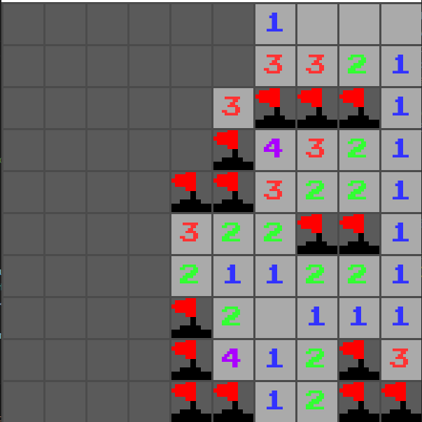
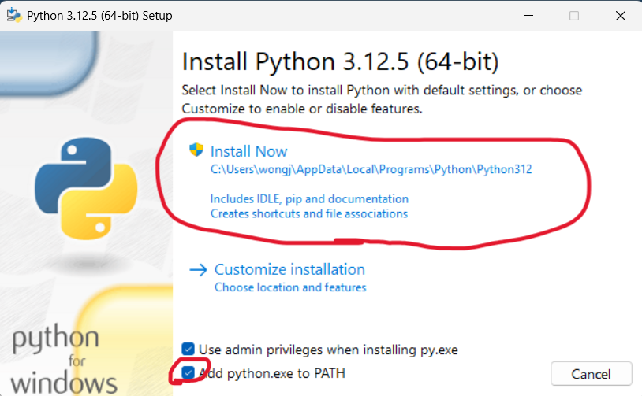
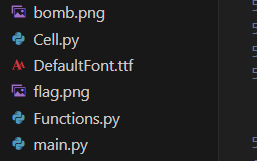
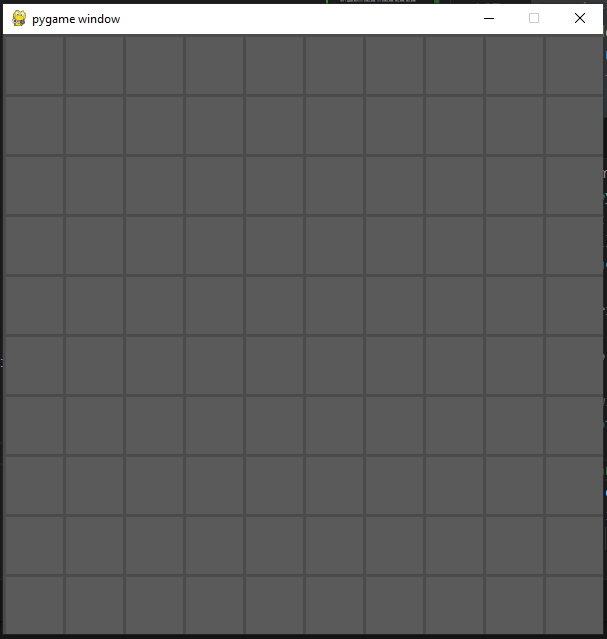
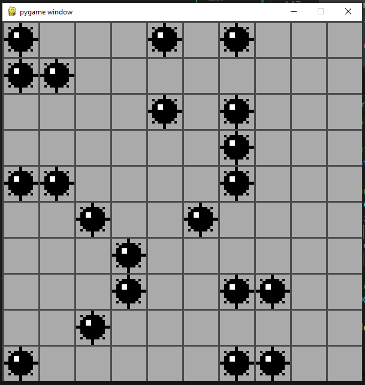
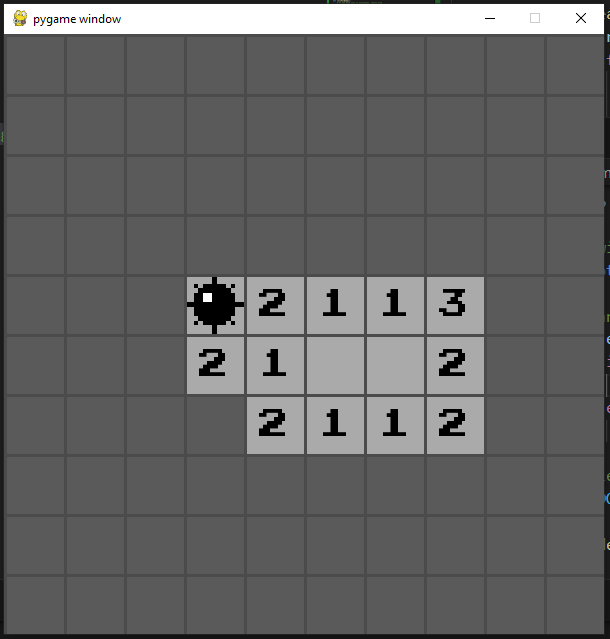
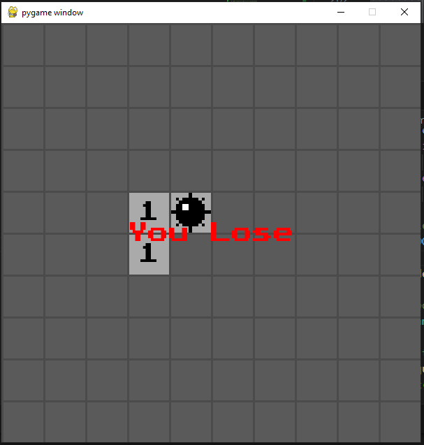
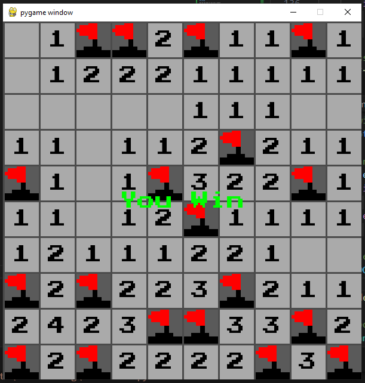
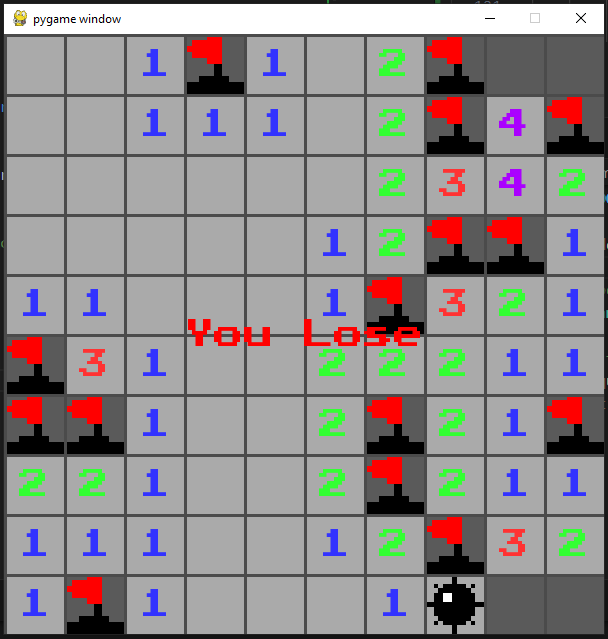

author: Caden Spokas
summary:
id: Minesweeper
tags:
categories:
environments: Web
status: Published
feedback link: https://github.com/bustlingbungus/Codelabs-Baseplate/tree/Minesweeper

# Minesweeper

## Overview

### Table Of Contents

1. This page
2. Environment setup
3. File downloads/pygame baseplate
4. Cell class definition
5. 2D Array of Cells
6. Accessing Surrounding Cells
7. Counting Adjacent Bombs
8. Revealing a Cell
9. Rendering Cells (part 1)
10. Rendering Cells (part 2)
11. Creating Grid of Cells
12. Rendering the Game
13. Calling Functions in main
14. Left Click to Reveal
15. Bomb Count Fix
16. Right Click to Add a Flag
17. Lose Condition
18. Win Condition
19. Breaking the Board
20. Improved Colouring (extra)
21. Revealing grid on Game End (extra)
22. Resetting the Game (extra)
23. Conclusion

### What You'll Learn

In this CodeLab, you'll learn how to code the classic Minesweeper game using pygame. More importantly, you'll learn about Python class definitions, organising game objects in a 2D array, and organising Python projects across multiple files.

### Final Game:



## Setting Up Environment

### VSCode and Python

We will be using VSCode to create the Python code for this project. These can be downloaded here:
* [VSCode](https://code.visualstudio.com/download)
* [Python](https://www.python.org/downloads/) 

> aside positive
> If you use some IDE other than VSCode, that should be fine!

### Make sure to check this box here:



### Pygame 

This project will use an API called `pygame` to create a window and render things onto it. To get pygame, just type the following command in a VSCode terminal:

For Windows:

``` bash
py -m pip install -U pygame --user
```

For Mac:

``` bash
python3 -m pip install -U pygame --user
```

Create a new folder on your computer for this project, and open it in VSCode.

## Get Project Baseplate

Download the baseplate files for this project [here](https://drive.google.com/file/d/1CjUvyzGQz7cn7O13nAkKgWaxJavK40ij/view?usp=sharing). Extract this file anywhere, and open the extracted folder in VSCode.



The folder will contain three .py files, `main`, `Cell`, and `Functions`. It will also contain two .png images, and one .ttf font. These are the assets we will use for Minesweeper.

`main.py` contains some code for opening a window with pygame. When creating the game, this will be the file that we actually run.

## Begin Defining the Cell Class

Minesweeper will consist of a grid of cells. Each cell can either be a bomb or safe. A cell can also be revealed or not revealed, and it can have a flag, or not have a flag. Additionally, our cells will contain their (x,y) coordinate in the grid.

Our cells will have a counter for how many bombs are adjacent to them, and if a cell IS a bomb, then this counter will be set to -1 to represent this.

Go to `Cell.py`, and begin defining a `Cell` class, like so:

``` Python
# A single cell on the minsweeper board
class Cell:

    # Initialise cell x and y indices, and whether the cell is a bomb
    # Initialise whether the cell is revealed, and whether ir contains a flag
    def __init__(self, isBomb, x, y):
        # If the cell is a bomb, make surrounding bombs -1
        if isBomb:
            self.surrounding_bombs = -1
        else:
            self.surrounding_bombs = 0
            
        self.revealed = False
        self.flagged = False
        
        # x and y represent the indices of the cell
        self.x, self.y = x, y
```

To make life easier, let's define a function to tell if a cell is a bomb, like this:

``` Python
# A single cell on the minsweeper board
class Cell:

    # Initialise cell x and y indices, and whether the cell is a bomb
    # Initialise whether the cell is revealed, and whether ir contains a flag
    def __init__(self, isBomb, x, y):
        # If the cell is a bomb, make surrounding bombs -1
        if isBomb:
            self.surrounding_bombs = -1
        else:
            self.surrounding_bombs = 0
            
        self.revealed = False
        self.flagged = False
        
        # x and y represent the indices of the cell
        self.x, self.y = x, y

    # |                     |
    # |  ADD THIS FUNCTION  |
    # V                     V

    def isBomb(self):
        return self.surrounding_bombs == -1
```

## Create Grid of Cells

We've defined an individual cell in the minesweeper grid, but we need a way to contain a bunch of cells. We're going to use a 2D array, to contain columns and rows of cells.

Go to `Functions.py`, and define these variables to create a 2D array of Cells:

``` Python
import pygame, math, random
#import cell class
from Cell import *

# turn on pygame
pygame.init()

# window dimensions
WIDTH, HEIGHT = 600, 600

# |                      |
# |  ADD THIS CODE HERE  |
# V                      V

# minesweeper grid dimensions
NX, NY = 10, 10
# side length of each cell
CELL_SIZE = WIDTH / NX
# array of all cells
cells = [[Cell(False,0,0) for i in range(NY)] for j in range(NX)]


# Create the window and fonts
WINDOW = pygame.display.set_mode((WIDTH, HEIGHT))
```

## Changes to Cell Class

Now that there's a container for all cells, we can start making some more code for the cells themselves.

### Why do cells need to look at each other?

> aside negative
> to count how many bombs are adjacent to themselves

Start by making a function for cells to get the cells surrounding themselves. The surrounding cells will be all the (x, y) cooridinates i unit away from the cell's coordinates (as long as x and y are in bounds)

Go to `Cell.py`, and add this function:

``` Python
# A single cell on the minsweeper board
class Cell:

    def __init__(self, isBomb, x, y):
        ...

    def isBomb(self):
        ...

    # |                          |
    # |  ADD THIS FUNCTION HERE  |
    # V                          V

    # Gets a list of the cells surrounding this one
    def surrounding(self):
        # import array from functions
        from Functions import cells, NX, NY
        surrounding = []
        
        # iterate through the 8 cells surrounding (x, y)
        # skip if the cell is out of bounds, or if the cell *is* (x, y)
        for i in range(self.x-1, self.x+2):
            if not 0<=i<NX: # cell out of bounds
                continue
            for j in range(self.y-1, self.y+2):
                if (not 0<=j<NY) or (j==self.y and i==self.x):
                    continue
                # Add the cell to the surorounding arry
                surrounding.append(cells[i][j])
        # return the array of surrounding cells
        return surrounding
```

## Make Cells Count Bombs

Now that cells can access their neighbours, there needs to be a way for them to see how many of said neighbours are bombs. This value will be saved to the cell's `surrounding_bombs` variable

Add this function to the `Cell` class:

``` Python
# A single cell on the minsweeper board
class Cell:

    def __init__(self, isBomb, x, y):
        ...

    def isBomb(self):
        ...

    def surrounding(self):
        ...

    # |                          |
    # |  ADD THIS FUNCTION HERE  |
    # V                          V

    # counts the number of surrounding cells that are bombs
    def countSurrounding(self):
        # do nothing if the cell is a bomb
        if not self.isBomb():
            # reset bomb counter to 0
            self.surrounding_bombs = 0
            # for each bomb in surrounding cells, increment the bomb counter
            for cell in self.surrounding():
                if cell.isBomb():
                    self.surrounding_bombs += 1
```

## Revealing a Cell

In minesweeper when  you left click a cell, it gets revealed so you can see how many bombs are around the cell. 

> aside negative
> If a cell has zero bombs surrounding it, then it should reveal all the surrounding cells.

Add this reveal function to the `Cell` class:

``` Python
# A single cell on the minsweeper board
class Cell:

    def __init__(self, isBomb, x, y):
        ...

    def isBomb(self):
        ...

    def surrounding(self):
        ...

    def countSurrounding(self):
        ...

    # |                          |
    # |  ADD THIS FUNCTION HERE  |
    # V                          V

    # Makes the cell revealed. If the cells has 0 surrounding bombs, 
    # reveals all adjacent cells
    def reveal(self):
        # make the cell revealed
        self.revealed = True
        # If there are not surrounding bombs, reveal all surrounding
        if self.surrounding_bombs == 0:
            for cell in self.surrounding():
                if not cell.revealed:
                    cell.reveal()
```

## Rendering Cells Part 1

Rendering the cell comes in three parts:

1. Checking if the cell is revealed or not
2. Rendering the cell background
3. Rendering cell images
    - If the cell is flagged, this means rendering a flag. If its'revealed, it means rendering the number of surrounding bombs, or a bomb if the cell is a bomb

> aside positive
> The cells will be rendered at a position based on it's (x, y) coordinates in the grid, as well as the cell side length

We're going to need to load images for a bomb and flag to render, as well as a font for showing the surrounding bombs count. Go to `Functions.py` and add these three lines:

``` Python
''' Functions.py '''
import pygame, math, random
#import cell class
from Cell import *

...

# array of all cells
cells = [[Cell(False,0,0) for i in range(NY)] for j in range(NX)]

# Create the window
WINDOW = pygame.display.set_mode((WIDTH, HEIGHT))


# |                        |
# |  ADD THESE LINES HERE  |
# V                        V

# Font for surrounding bombs
FONT = pygame.font.Font("PixelFont.ttf", int(CELL_SIZE/2))
# Textures for flag and bomb, scaled to match cell dimensions
FLAG = pygame.transform.scale(pygame.image.load("flag.png"), (CELL_SIZE,CELL_SIZE))
BOMB = pygame.transform.scale(pygame.image.load("bomb.png"), (CELL_SIZE,CELL_SIZE))
```

With these loaded, go back to `Cell.py` to add the `render` function to the `Cell` class:

``` Python
''' Cell.py '''
# A single cell on the minsweeper board
class Cell:
    def __init__(self, isBomb, x, y):
        ...
    def isBomb(self):
        ...
    def surrounding(self):
        ...
    def countSurrounding(self):
        ...
    def reveal(self):
        ...
    
    # |                          |
    # |  ADD THIS FUNCTION HERE  |
    # V                          V

    # Renders the cell onto the screen
    def render(self):
        # get required variables from functions
        from Functions import WINDOW, FONT, CELL_SIZE, FLAG, BOMB
        # Set up a rect to represent the cell's space on the window
        rect = pygame.Rect(self.x*CELL_SIZE, self.y*CELL_SIZE, CELL_SIZE, CELL_SIZE)
```

## Rendering Cells Part 2

### Steps 1 and 2

As mentioned before, there will be three steps to cell rendering. Let's implement the first two,

> aside positive
> Checking if the cell is revealed or not, and Rendering the cell background.

We'll render a darker background for hidden cells, and a lighter one for revealed cells

Add this code to the `render` function we just made:

``` Python
# Renders the cell onto the screen
def render(self):
    # get required variables from functions
    from Functions import WINDOW, FONT, CELL_SIZE, FLAG, BOMB
    # Set up a rect to represent the cell's space on the window
    rect = pygame.Rect(self.x*CELL_SIZE, self.y*CELL_SIZE, CELL_SIZE, CELL_SIZE)

    # |                      |
    # |  ADD THIS CODE HERE  |
    # V                      V

    # If the cells is revealed, show the number of surrounding bombs, or,
    # if the cell IS a bomb, render the bomb image
    if self.revealed:
        # render cell background
        pygame.draw.rect(WINDOW, (170,170,170), rect)

    # If the cell ISN'T revealed, just render the cell backgorund
    # if the cell has a flag, render the flag image
    else:
        pygame.draw.rect(WINDOW, (90,90,90), rect)
```

### Step 3

And for the final step:

> aside positive
> Rendering cell images

If the cell is flagged, this means rendering a flag. If its'revealed, it means rendering the number of surrounding bombs, or a bomb if the cell is a bomb.

Add this code in the `render` function:

``` Python
# Renders the cell onto the screen
def render(self):
    # get required variables from functions
    from Functions import WINDOW, FONT, CELL_SIZE, FLAG, BOMB
    # Set up a rect to represent the cell's space on the window
    rect = pygame.Rect(self.x*CELL_SIZE, self.y*CELL_SIZE, CELL_SIZE, CELL_SIZE)


    # If the cells is revealed, show the number of surrounding bombs, or,
    # if the cell IS a bomb, render the bomb image
    if self.revealed:
        # render cell background
        pygame.draw.rect(WINDOW, (170,170,170), rect)

        # |                      |
        # |  ADD THIS CODE HERE  |
        # V                      V

        # render bomb image if the cell is a bomb
        if self.isBomb():
            WINDOW.blit(BOMB, rect)
        # Render a number for the surrounding bomb count
        elif self.surrounding_bombs > 0:
            num = FONT.render(str(self.surrounding_bombs), True, (0,0,0))
            num_rect = num.get_rect(center=(rect.x+rect.w/2,rect.y+rect.h/2))
            WINDOW.blit(num, num_rect)

    # If the cell ISN'T revealed, just render the cell backgorund
    # if the cell has a flag, render the flag image
    else:
        pygame.draw.rect(WINDOW, (90,90,90), rect)

        # |                      |
        # |  ADD THIS CODE HERE  |
        # V                      V

        if self.flagged:
                WINDOW.blit(FLAG, rect)
```

## Creating the Grid

Wow, that was a lot of "defining the cell class" just to not add anything into the game. Let's finally create the grid to play Minesweeper!

We'll need two functions, one to create the grid, and one helper to decide if each cell will be a bomb.

### Bomb Checking Function

We'll have a 25% chance for each cell to be a bomb. So, for this function, we'll create a random number between 0 and 1, and if it's less than o.25 (a 25%), return true.

Add this function to `Functions.py`:

``` Python
''' Functions.py '''
import pygame, math, random
#import cell class
from Cell import *

...

# Font for surrounding bombs
FONT = pygame.font.Font("PixelFont.ttf", int(CELL_SIZE/2))
# Textures for flag and bomb, scaled to match cell dimensions
FLAG = pygame.transform.scale(pygame.image.load("flag.png"), (CELL_SIZE,CELL_SIZE))
BOMB = pygame.transform.scale(pygame.image.load("bomb.png"), (CELL_SIZE,CELL_SIZE))

# |                       |
# |  ADD THIS STUFF HERE  |
# V                       V

##############################
#                            #
#      GRID MANAGEMENT       #
#                            #
##############################

def rollForBomb():
    # If the bomb roll is successful, return true
    if random.uniform(0, 1) < 0.25:
        return True
    return False
```

### Grid Creation Function

We'll create the grid by iterating through each item in the `cells` array, and creating a new cell to in that spot. 

Add this `createGrid()` function:

``` Python
##############################
#                            #
#      GRID MANAGEMENT       #
#                            #
##############################

def rollForBomb():
    ...

# |                          |
# |  ADD THIS FUNCTION HERE  |
# V                          V

def createGrid():
    global cells

    # re-initialise the grid with new cells
    cells = [[Cell(rollForBomb(), j, i) for i in range(NY)] for j in range(NX)]
```

## Rendering the Game

We defined a function for rendering cells, so we just need a way to iterate through all of our cells and render each one. We're also going to render some gridlines to make it easier to distinguish individual cells.

Adds these three functions to `Functions.py`:

``` Python
''' Functions.py '''

def rollForBomb():
    ...
def createGrid():
    ...

# |                       |
# |  ADD THIS STUFF HERE  | 
# V                       V

##############################
#                            #
#    RENDERING FUNCTIONS     #
#                            #
##############################


# render all cells in the grid
def renderCells():
    for row in cells:
        for cell in row:
            cell.render()
            
# renders all the grid lines
def renderGrid():
    # render vertical gridlines
    line = pygame.Rect(0, 0, 3, HEIGHT)
    for i in range(NX):
        line.x = CELL_SIZE * i
        pygame.draw.rect(WINDOW, (75,75,75), line)
        
    # render horizontal gridlines
    line = pygame.Rect(0, 0, WIDTH, 3)
    for i in range(NY):
        line.y = CELL_SIZE * i
        pygame.draw.rect(WINDOW, (75,75,75), line)

# This one is just to make life easier 
def render():
    # call rendering helper functions 
    renderCells()
    renderGrid()
```

## Adding functions to main

Now that there's a way to create the grid and render it, we can finally have the game show up in the actual window. Only 13 pages to add anything into the window, better late than never!

Make these changes in `main.py`

``` Python
''' main.py '''
import pygame, sys
# Import game code
from Cell import *
from Functions import *

createGrid()                # <----- ADD THIS LINE HERE

quit_app = False

# Main window loop
while not quit_app:
    
    # Handle inputs
    for event in pygame.event.get():
        if event.type == pygame.QUIT:
            quit_app = True
    
    # Clear window
    WINDOW.fill("black")
    
    render()                # <----- ADD THIS LINE HERE
    
    # update the display
    pygame.display.update()
    
# close the application
pygame.quit()
sys.exit()
```

> aside negative 
> Fun fact, this is 50% of the code we'll be adding to `main.py` in this entire project!

### Run main

If you run `main.py`, you should see this window now:



## Left Clicking

Right now, this game is pretty lame since all the cells are hidden, since you can't left click anything to reveal them.

When you left click, we need to do 2 things:

1. Find what cell you clicked on
2. Reveal that cell

> aside negative
> Technically it's three things, since if the cell revealed is a bomb you should lose the game, but we'll get to that later.

> aside negative
> When clicking on a cell, it should be revealed only if it DOESN'T have a flag.

Since the cells split the window perfectly into `CELL_SIZE` sized squares, we can convert (x, y) coordinates on the window to array indices by just dividing x and y by `CELL_SIZE`.

Add these two functions in `Functions.py`:

``` Python
''' Functions.py '''

def rollForBomb():
    ...
def createGrid():
    ...

# |                       |
# |  ADD THIS STUFF HERE  | 
# V                       V

##############################
#                            #
#      INPUT FUNCTIONS       #
#                            #
##############################

# left click on the (x,y) coordinates
# left clicking reveals non flagged cells
def leftClick(x, y):
    
    # convert the mouse position to cell indices
    cx, cy = int(x/CELL_SIZE), int(y/CELL_SIZE)
    # return if either index is out of bounds  
    if not (0<=cx<NX and 0<=cy<NY):
        return
    
    # reveal cells that get clicked, don't reveal flagged cells
    cell = cells[cx][cy]
    if not cell.flagged:
        cell.reveal()

# Gets user input 
def getInput(event):
    # when left/right clicking, get mouse position, and call the appropriate function
    if event.type == pygame.MOUSEBUTTONDOWN:
        # get mouse positions and which buttons are active
        mousex, mousey = pygame.mouse.get_pos()
        mouse_buttons = pygame.mouse.get_pressed()
        if mouse_buttons[0]:
            leftClick(mousex, mousey)
```

### Calling in main

Now, go to `main.py`, and add this line to call the input function:

``` Python
''' main.py '''
...

# Main window loop
while not quit_app:
    
    # Handle inputs
    for event in pygame.event.get():
        if event.type == pygame.QUIT:
            quit_app = True
        else:                       # <----- ADD THIS LINE HERE
            getInput(event)         # <----- ADD THIS LINE HERE
    
    # Clear window
    WINDOW.fill("black")
...
```

> aside negative
> Fun fact, this is the last change we will make to main.py

Now, when you click on a cell, something like this should happen:



This is happening because none of the cells have had their `countSurrounding` function called anywhere, so all the non-bomb cells think they have zero surrounding bombs, and reveal their neighbours when they get revealed.

## Fixing bomb counts

When creating the grid, let's call a new function, called `breakBoard` (the name will make sense later), to make all the cells count their neighbours when the grid is created.

Make these changes in `Funcitons.py`:

``` Python
''' Functions.py '''
##############################
#                            #
#      GRID MANAGEMENT       #
#                            #
##############################

# |                          |
# |  ADD THIS FUNCTION HERE  | 
# V                          V

def breakBoard():
    # iterate through each cell, and update the cell's surrounding count
    for x in range(NX):
        for y in range(NY):
            cells[x][y].countSurrounding()

def rollForBomb():
    ...

def createGrid():
    global cells

    # re-initialise the grid with new cells
    cells = [[Cell(rollForBomb(), j, i) for i in range(NY)] for j in range(NX)]

    breakBoard()        # <----- ADD THIS LINE HERE
```

NOW when you run `main.py`, if you left click on a cell it should reveal it as expected:



## Right Clicking

When right clicking on a cell, if it's not revealed we should add a flag if it has none, or remove a flag if it already does. In other words, we're going to toggle the flag

> aside negative
> Like left clicking, there should also be a condition where if you flag all bombs you win, but this will also be handled later

We can find the cell clicked on the same way we did for left clicking, so add this code to `Functions.py`:

``` Python
''' Functions.py '''
...

##############################
#                            #
#      INPUT FUNCTIONS       #
#                            #
##############################

# left click on the (x,y) coordinates
# left clicking reveals non flagged cells
def leftClick(x, y):
    ...

# |                          |
# |  ADD THIS FUNCTION HERE  |
# V                          V

# right click on the (x, y) coordinates
# right clicking toggles flag on non-revealed cells      
def rightClick(x, y):
    # convert the mouse position to cell indices
    cx, cy = int(x/CELL_SIZE), int(y/CELL_SIZE)
    # return if either index is out of bounds  
    if not (0<=cx<NX and 0<=cy<NY):
        return
    
    # toggle the flag for cells that get right clicked
    cell = cells[cx][cy]
    cell.flagged = not cell.flagged

# Gets user input 
def getInput(event):
    # when left/right clicking, get mouse position, and call the appropriate function
    if event.type == pygame.MOUSEBUTTONDOWN:
        # get mouse positions and which buttons are active
        mousex, mousey = pygame.mouse.get_pos()
        mouse_buttons = pygame.mouse.get_pressed()
        if mouse_buttons[0]:
            leftClick(mousex, mousey)
        elif mouse_buttons[2]:              # <----- ADD THIS LINE HERE
            rightClick(mousex, mousey)      # <----- ADD THIS LINE HERE
```

Now when you right click, the cell you clicked on will have it's flag turned on/off!

> aside negative
> Technically, with this code you can toggle flags on revealed cells as well, but becuase of how we set up the rendering code, you just can't see the flag on revealed cells.

## Losing

How do you know if you are a loser?

1. If you have no friends (looking at all of you)
2. If you left click on a bomb

We're only going to add code for the second one today. Let's start by adding a variable to track whether the game has ended in `Functions.py`.

``` Python
''' Functions.py '''
import pygame, math, random
#import cell class
from Cell import *

# turn on pygame
pygame.init()

# window dimensions
WIDTH, HEIGHT = 600, 600

# minesweeper grid dimensions
NX, NY = 10, 10
# side length of each cell
CELL_SIZE = WIDTH / NX
# array of all cells
cells = [[Cell(False,0,0) for i in range(NY)] for j in range(NX)]

# whether or not the game has ended
game_over = False                   # <----- ADD THIS LINE HERE

# Create the window and fonts
WINDOW = pygame.display.set_mode((WIDTH, HEIGHT))
...
```

Now go to `leftClick`. If you reveal a bomb cell, we'll set `game_over` to `True`:

``` Python
...
##############################
#                            #
#      INPUT FUNCTIONS       #
#                            #
##############################

# left click on the (x,y) coordinates
# left clicking reveals non flagged cells
def leftClick(x, y):

    global game_over                # <----- ADD THIS LINE HERE
    
    # convert the mouse position to cell indices
    cx, cy = int(x/CELL_SIZE), int(y/CELL_SIZE)
    # return if either index is out of bounds  
    if not (0<=cx<NX and 0<=cy<NY):
        return
    
    # reveal cells that get clicked, don't reveal flagged cells
    cell = cells[cx][cy]
    if not cell.flagged:
        cell.reveal()
        if cell.isBomb():               # <----- ADD THIS LINE HERE
            game_over = True            # <----- ADD THIS LINE HERE
...
```

### Rendering Game Over

We need to tell players that they lost, so that everyone knows full well how much of a loser they are. We'll do this by rending text to the screen when the game is over

Add this code to `render`:

``` Python
...
##############################
#                            #
#    RENDERING FUNCTIONS     #
#                            #
##############################

def renderCells():
    ...            
def renderGrid():
    ...

# This one is just to make life easier 
def render():
    # call rendering helper functions 
    renderCells()
    renderGrid()

    # |                      |
    # |  ADD THIS CODE HERE  |
    # V                      V
    
    # if the game has ended, render the victory or loss text
    if game_over:
        txt = FONT.render("You Lose", True, "red")
        txt_rect = txt.get_rect(center=(WIDTH/2,HEIGHT/2))
        WINDOW.blit(txt, txt_rect)
```

Now when you click on a bomb, this will happen:



## Winning

How do you knoww if you are a winner?

1. If you live a healthy life with an overall feeling of satisfaction
2. You flag all the bombs on a minesweeper board

We're only going to cover that second one today, and we're going to do it by counting the number of bombs on the board, and decrementing that counter when the player correctly flags a bomb. They win when the counter is 0 (there are no unflagged bombs).

Add this variable in `Fucntions.py` to track the number of bombs:

``` Python
''' Functions.py '''
import pygame, math, random
#import cell class
from Cell import *

# turn on pygame
pygame.init()

# window dimensions
WIDTH, HEIGHT = 600, 600

# minesweeper grid dimensions
NX, NY = 10, 10
# side length of each cell
CELL_SIZE = WIDTH / NX
# array of all cells
cells = [[Cell(False,0,0) for i in range(NY)] for j in range(NX)]

# The number of unflagged bombs
numBombs = 0                            # <----- ADD THIS LINE HERE
# whether or not the game has ended
game_over = False

# Create the window and fonts
WINDOW = pygame.display.set_mode((WIDTH, HEIGHT))
```

### Counting bombs

To count the number of bombs on the board, we're just going to change the `rollForBomb` function, to increment the counter every time it returns true, like so:

``` Python
##############################
#                            #
#      GRID MANAGEMENT       #
#                            #
##############################

def breakBoard():
    ...

def rollForBomb():

    global numBombs             # <----- ADD THIS LINE HERE

    # If the bomb roll is successful, return true
    if random.uniform(0, 1) < 0.25:

        numBombs += 1           # <----- ADD THIS LINE HERE
        return True
    return False
...
```

### Detecting a W

When we right click to toggle flag, we should decrement the counter when flagging a bomb. So, in the `rightClick` function, after we decrement the counter, if the counter is `0` we'll set `game_over` to `True`

> aside negative
> Note: In `rightClick` we should also increment the counter if a flag was removed from a bomb cell

Make these changes in the `rightClick` function:

``` Python
##############################
#                            #
#      INPUT FUNCTIONS       #
#                            #
##############################

def leftClick(x, y):
    ...
        
# right click on the (x, y) coordinates
# right clicking toggles flag on non-revealed cells      
def rightClick(x, y):

    global game_over, numBombs                      # <----- ADD THIS LINE HERE

    # convert the mouse position to cell indices
    cx, cy = int(x/CELL_SIZE), int(y/CELL_SIZE)
    # return if either index is out of bounds  
    if not (0<=cx<NX and 0<=cy<NY):
        return
    
    # toggle the flag for cells that get right clicked
    cell = cells[cx][cy]
    cell.flagged = not cell.flagged

    # |                      |
    # |  ADD THIS CODE HERE  |
    # V                      V

    if cell.isBomb():
        # change bomb count when a bomb is toggled 
        if not cell.flagged:
            numBombs += 1
        else:
            numBombs -= 1
        # win when there are no bombs left
        if numBombs == 0:
            game_over = True
...
```

### Rendering the W

Finally, so that we don't render "You Lose" when you actually win, make this change to `render`:

``` Python
##############################
#                            #
#    RENDERING FUNCTIONS     #
#                            #
##############################

def renderCells():
    ...
def renderGrid():
    ...

# This one is just to make life easier 
def render():
    # call rendering helper functions 
    renderCells()
    renderGrid()
    
    # if the game has ended, render the victory or loss text
    if game_over:
        if numBombs != 0:       # <----- ADD THIS LINE HERE

            # v  INDENT THESE THREE LINES v
            txt = FONT.render("You Lose", True, "red")
            txt_rect = txt.get_rect(center=(WIDTH/2,HEIGHT/2))
            WINDOW.blit(txt, txt_rect)
        
        # |                      |
        # |  ADD THIS CODE HERE  |
        # V                      V

        else:
            txt = FONT.render("You Win", True, "green")
            txt_rect = txt.get_rect(center=(WIDTH/2,HEIGHT/2))
            WINDOW.blit(txt, txt_rect)

```
> aside positive
> Now when you flag all the bombs, it'll say you win the game!!! :)



## Breaking the Board

Right now, the game is really hard, because the first few cells you click are pretty much random, and they could very well be a bomb. We should start the game by revealing a cell that has zero surrounding bombs, so the player doesn't have to guess for their first few cells.

We're going to do this by editing `breakBoard` to reveal a cell that has zero surrounding bombs, lise so:

``` Python
''' Functions.py '''
##############################
#                            #
#      GRID MANAGEMENT       #
#                            #
##############################

def breakBoard():
    # indices of the cell that will be revealed
    bx, by = -1, -1                     # <----- ADD THIS LINE HERE

    # iterate through each cell, and update the cell's surrounding count
    # if the number of surrounding bombs is 0, update bx and by
    for x in range(NX):
        for y in range(NY):
            cells[x][y].countSurrounding()
            if cells[x][y].surrounding_bombs == 0:  # <----- ADD THIS LINE HERE
                bx, by = x, y                       # <----- ADD THIS LINE HERE

    # |                      |
    # |  ADD THIS CODE HERE  |
    # V                      V

    # if a cell to reveal was found, reveal it and return true
    if bx>=0 and by>=0:
        cells[bx][by].reveal()
        return True
    # return failure
    return False
```

### Error Handling 

> aside negative
> Because grid generation is random, it is possible for there to be NO cells with zero surrounding bombs. As you can see above, in this case we do not reveal the cell, and instead return False. If this happens, we should regenerate the board, which hopefully will have a zero cell.

Add this code to `createGrid`:

``` Python
##############################
#                            #
#      GRID MANAGEMENT       #
#                            #
##############################

def breakBoard():
    ...
def rollForBomb():
    ...

def createGrid():
    global cells

    # re-initialise the grid with new cells
    cells = [[Cell(rollForBomb(), j, i) for i in range(NY)] for j in range(NX)]
    
    if not breakBoard():        # <----- MODIFY THIS LINE HERE
        createGrid()            # <----- ADD THIS LINE HERE
```

## Getting Better Colours (extra)

All the numbers right now are pitch black. It would be nicer if they had different colours based on what number they are. Let's start by making a function to determine colour based on the number of surrounding bombs.

Go to `Cell.py`, and add this function before Cell definition:

``` Python
''' Cell.py '''
import pygame

# Returns a colour based on the number of bombs surrounding a cell
def getColor(numSurroundingBombs):
    match (numSurroundingBombs):
        case 1: 
            return (50,50,255)
        case 2:
            return (50,255,50)
        case 3: 
            return (255,50,50)
        case 4:
            return (170,0,255)
        case 5: 
            return (255,255,0)
        case 6:
            return (255,150,0)
        case 7: 
            return (20,20,20)
        case 8:
            return (30,0,0)
    return (0,0,0)

# A single cell on the minsweeper board
class Cell:
    ...
```

> aside negative
> These colours were chosen arbitrarily, you can make the function return whatever you like

### Calling the new function

Now go to the cell's `render` function. We're going to change the line that makes the number black, and make it call this new function for a colour instead.

Make this change:

``` Python
...
class Cell:
    def __init__(self, isBomb, x, y):
        ...
    def isBomb(self):
        ...
    def surrounding(self):
        ...
    def countSurrounding(self):
        ...
    def reveal(self):
        ...
                    
    # Renders the cell onto the screen
    def render(self):
        # get required variables from functions
        from Functions import WINDOW, FONT, CELL_SIZE, FLAG, BOMB
        # Set up a rect to represent the cell's space on the window
        rect = pygame.Rect(self.x*CELL_SIZE, self.y*CELL_SIZE, CELL_SIZE, CELL_SIZE)
        
        # If the cells is revealed, show the number of surrounding bombs, or,
        # if the cell IS a bomb, render the bomb image
        if self.revealed:
            # render cell background
            pygame.draw.rect(WINDOW, (170,170,170), rect)
            
            # render bomb image if the cell is a bomb
            if self.isBomb():
                WINDOW.blit(BOMB, rect)
            # Render a number for the surrounding bomb count
            elif self.surrounding_bombs > 0:

                # |                                         |
                # |  CHANGE THIS LINE TO CALL THE FUNCTION  |
                # V                                         V

                num = FONT.render(str(self.surrounding_bombs), True, getColor(self.surrounding_bombs))

                num_rect = num.get_rect(center=(rect.x+rect.w/2,rect.y+rect.h/2))
                WINDOW.blit(num, num_rect)

        # If the cell ISN'T revealed, just render the cell backgorund
        # if the cell has a flag, render the flag image
        else:
            pygame.draw.rect(WINDOW, (90,90,90), rect)
            if self.flagged:
                WINDOW.blit(FLAG, rect)
```

Now the game looks a LOT nicer :)

 

## Revealing All Cells (extra)

When you lose, we should make it clear why you're such a loser. We should reveal all the cells so that you know what you did wrong. 

We won't reveal cells that were correctly flagged, so that you also know what you did right.

Add this function to `Functions.py`:

``` Python
##############################
#                            #
#      GRID MANAGEMENT       #
#                            #
##############################

def breakBoard():
    ...
def rollForBomb():
    ...
def createGrid():
    ...

# reveal all cells in the grid. do not reveal bombs that have been correctly flagged
def revealAll():
    for row in cells:
        for cell in row:
            if not cell.revealed:
                if not (cell.isBomb() and cell.flagged):
                    cell.reveal()
```

Now, we'll call this function in both places that `game_over` gets set to `True`.

Call the function in `leftClick` and `rightClick`, like so:

``` Python
##############################
#                            #
#      INPUT FUNCTIONS       #
#                            #
##############################

# left click on the (x,y) coordinates
# left clicking reveals non flagged cells
def leftClick(x, y):
    global game_over
    
    # convert the mouse position to cell indices
    cx, cy = int(x/CELL_SIZE), int(y/CELL_SIZE)
    # return if either index is out of bounds  
    if not (0<=cx<NX and 0<=cy<NY):
        return
    
    # reveal cells that get clicked, don't reveal flagged cells
    cell = cells[cx][cy]
    if not cell.flagged:
        cell.reveal()
        if cell.isBomb():
            revealAll()             # <----- ADD THIS LINE HERE
            game_over = True
        
# right click on the (x, y) coordinates
# right clicking toggles flag on non-revealed cells      
def rightClick(x, y):
    global game_over, numBombs
    # convert the mouse position to cell indices
    cx, cy = int(x/CELL_SIZE), int(y/CELL_SIZE)
    # return if either index is out of bounds  
    if not (0<=cx<NX and 0<=cy<NY):
        return
    
    # toggle the flag for cells that get right clicked
    cell = cells[cx][cy]
    cell.flagged = not cell.flagged
    
    if cell.isBomb():
        # change bomb count when a bomb is toggled 
        if not cell.flagged:
            numBombs += 1
        else:
            numBombs -= 1
        # win when there are no bombs left
        if numBombs == 0:
            revealAll()             # <----- ADD THIS LINE HERE
            game_over = True
```

## Resetting the Game (extra)

It's kind of annoying how we have to close the game and relaunch it to reset. Let's make it so that the game resets when you press the spacebar.

> aside positive
> "Resetting" here basically just means calling `createGrid` to recreate the grid, then setting `game_over` back to `False`.

Add this code to `getInput`:

``` Python
##############################
#                            #
#      INPUT FUNCTIONS       #
#                            #
##############################

def leftClick(x, y):
    ...     
def rightClick(x, y):
    ...

# Gets user input 
def getInput(event):

    global game_over        # <----- ADD THIS LINE HERE

    # when left/right clicking, get mouse position, and call the appropriate function
    if event.type == pygame.MOUSEBUTTONDOWN:
        # get mouse positions and which buttons are active
        mousex, mousey = pygame.mouse.get_pos()
        mouse_buttons = pygame.mouse.get_pressed()
        if mouse_buttons[0]:
            leftClick(mousex, mousey)
        elif mouse_buttons[2]:
            rightClick(mousex, mousey)

    # |                      |
    # |  ADD THIS CODE HERE  |
    # V                      V

    # If the player presses space, reset the game by creating a new grid
    elif event.type == pygame.KEYDOWN:
        if event.key == pygame.K_SPACE:
            createGrid()
            game_over = False
```

Now when you press space, the game resets!

## YAAAYYYY WE HAVE MINESWEEPER!!!!!


Now you have working minesweeper, only after 22 CodeLab pages! So brief!

This is certainly one of the longest workshop projects so thank you for making it to the end, hopefully you learned something about game dev today!

Now. Look at Solly here. He is so so hungry because we have no money to feed him. Only YOU can make a change, by checking in to the event on bullsconnect.