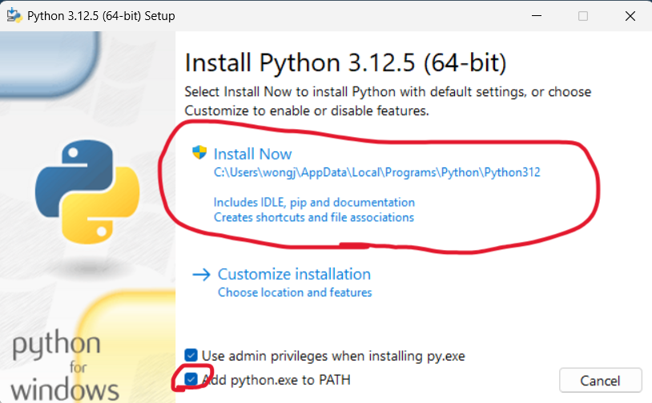
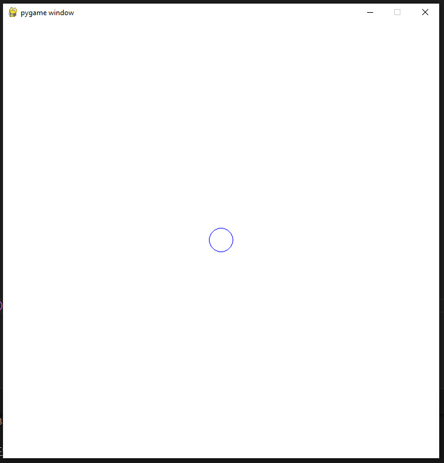
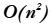
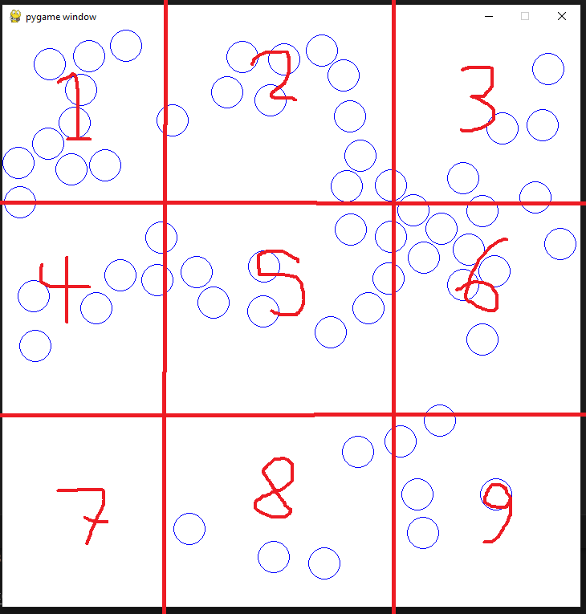

author: Caden Spokas
summary:
id: Physics2dCodelab
tags:
categories:
environments: Web
status: Published
feedback link: https://github.com/bustlingbungus/Codelabs-Baseplate/tree/Physics_2D

# 2D Physics Simulation

## Overview

### Table of Contents

1. This page
2. Setup Python and pygame
3. Adding one object to the game
4. Creating the Vector2 class
5. Adding basic physics
6. Adding multiple objects into the game
7. Collision Mechanics Part 1
8. Collision Mechanics Part 2
9. User Input Part 1 (extra)
10. User Input Part 2 (extra)
11. Optimisation Discussion (extra)
12. Conclusion

### Final Simulation


## Setting Up Environment

### VSCode and Python

We will be using VSCode to create the Python code for this project. These can be downloaded here:
* [VSCode](https://code.visualstudio.com/download)
* [Python](https://www.python.org/downloads/) 

> aside positive
> If you use some IDE other than VSCode, that should be fine!

### Make sure to check this box here:



### Pygame 

This project will use an API called `pygame` to create a window and render things onto it. To get pygame, just type the following command in a VSCode terminal:

For Windows:

``` bash
py -m pip install -U pygame --user
```

For Mac:

``` bash
python3 -m pip install -U pygame --user
```

Create a new folder on your computer for this project, and open it in VSCode.

## Creating an Individual Game Object

### Create two files

This project will be split between two files. One for the management code, and one for class definitions. In your folder, create
* main.py
* Classes.py

### main.py (pygame boilerplate)

This is just a baseplate for opening a window in pygame. We'll be modifying this as we develop the project

``` Python
import pygame, sys

# Colour variables 
BACKGROUND_COLOR = "white"

# Window dimensions. Set up the window, and a clock
WIDTH, HEIGHT = 720, 720
WINDOW = pygame.display.set_mode((WIDTH, HEIGHT))
CLOCK = pygame.time.Clock()

quit_app = False

# Main simulation loop
while (not quit_app):
    
    # Handle input
    for event in pygame.event.get():
        # Exit when you press the X
        if event.type == pygame.QUIT:
            quit_app = True

    # Fill the window with a solid colour
    WINDOW.fill(BACKGROUND_COLOR)

    # Update the window
    pygame.display.update()
    CLOCK.tick(300)

# Close the application when the main loop exits
pygame.quit()
sys.exit()
```

### Classes.py (entity definition)

In this simulation, we're going to make circles that bounce around the window. Each of these balls will have a position, and a radius, so in `Classes.py`, let's define a class for them like this:

``` Python
# A class for a collision object
class Ball:
    # Initialise position and radius
    def __init__(self, x, y, radius):
        self.x, self.y = x, y
        self.radius = radius
```

### Adding a ball in main.py

To add an individual ball onto the window, go back to `main.py`, and include this class definition. Then create a ball object and render it every frame.

``` Python
# Create a ball object
object = Ball(360, 360, 20)         # <------------- ADD THIS LINE HERE

quit_app = False

# Main simulation loop
while (not quit_app):
    
    # Handle input
    for event in pygame.event.get():
        # Exit when you press the X
        if event.type == pygame.QUIT:
            quit_app = True

    # Fill the window with a solid colour
    WINDOW.fill(BACKGROUND_COLOR)
    
    # Render the ball at its position
    pygame.draw.circle(WINDOW, "blue", (object.x, object.y), object.radius, 1) # <----- ADD THIS LINE HERE

    # Update the window
    pygame.display.update()
    CLOCK.tick(300)
```

### When you run `main.py`, there should now be a circle in the middle of the window.



## Creating the Vector2 class

To represent position in 2D space, the x and y coordinates can be made into a 2D vector. Creating a class for a 2D vector will be useful because we can organise an x,y pair into one object, and we can add class functions like `length` to find vector magnitude, and overload operators to make vector arithmetic easier.

Go to `Classes.py`, and before the `Ball` class definition, create a `Vector2` class:

``` Python
# Define a structure to represent 2D position, velocity, and acceleration
class Vector2:
    
    # Initialise x and y variables 
    def __init__(self, x = 0, y = 0):
        self.x, self.y = x, y
```

For later use in this project, we're going to need to find the magnitude of a vector, as well as create unit vectors (which is a vector whose magnitude is 1).

We're also going to overload operators to allow for arithmetic between two vector objects, using traditional operators, like `+` and `*`.

Add these functions to the `Vector2`: 

``` Python
from math import sqrt       # <-------- ADD THIS LINE HERE

# Define a structure to represent 2D position, velocity, and acceleration
class Vector2:
    
    # Initialise x and y variables 
    def __init__(self, x = 0, y = 0):
        self.x, self.y = x, y

    # |                        |
    # |   ADD THESE FUNCTIONS  |
    # V                        V

    # The magnitude of the vector is sqrt(x^2 + y^2)
    def length(self):
        return sqrt((self.x**2) + (self.y**2))
    
    # Make the vector's length 1 by dividing x and y by the length
    def normalize(self):
        leng = self.length()
        self.x /= leng
        self.y /= leng

    # Redefine basic operators to make vector arithmetic easier
    
    # Redefine - to return this vector minus the other vector
    def __sub__(self, other):
        return Vector2(self.x - other.x, self.y - other.y)
    
    # Redefine -= to subtract the other vector's x and y components from this one
    def __isub__(self, other):
        return Vector2(self.x - other.x, self.y - other.y)
    
    # Redefine += to add the other vector's x and y components to this one
    def __iadd__(self, other):
        return Vector2(self.x + other.x, self.y + other.y)
        
    # Redefine * to return x and y multiplied by k
    def __mul__(self, k):
        return Vector2(self.x * k, self.y * k)
```
> aside negative
> We could add other operator overloads for things like scalar division, the dot product, etc. I wanted to reduce clutter though, since those operations aren't used in this project. See if you can implement them! :)

### Give the Ball class Vector2 members

Let's replace the `Ball` class' position with one Vector2, and add a velocity and acceleration vector to the class as well.

* In `Classes.py`:

``` Python
# A class for a collision object
class Ball:
    # Initialise position, velocity, acceleration, and radius
    def __init__(self, x, y, radius):
        self.pos = Vector2(x, y)            # <------ ADD THIS LINE HERE
        self.velocity = Vector2(0, 0)       # <------ ADD THIS LINE HERE
        self.acceleration = Vector2(0, 0)   # <------ ADD THIS LINE HERE
        
        self.radius = radius
```

* In `main.py`:

``` Python
# Create a ball object
object = Ball(360, 360, 20)

quit_app = False

# Main simulation loop
while (not quit_app):
    
    # Handle input
    for event in pygame.event.get():
        # Exit when you press the X
        if event.type == pygame.QUIT:
            quit_app = True

    # Fill the window with a solid colour
    WINDOW.fill(BACKGROUND_COLOR)
    
    # Render the ball at its position
    # |                  |
    # | MODIFY THIS LINE |
    # V                  V
    pygame.draw.circle(WINDOW, "blue", (object.pos.x, object.pos.y), object.radius, 1)

    # Update the window
    pygame.display.update()
    CLOCK.tick(300)
```

## Add basic physics

### Add Gravity

Let's start by applying gravity to the ball every frame. To do this, we're just going to set the ball's velocity to a constant gravity vector, then add acceleration to velocity, and velocity to position every frame.
We'll package all this into one `update` function, which will be called every frame.

In `Classes.py`, update the `Ball` class:

``` Python
# A class for a collision object
class Ball:
    # Initialise position, velocity, acceleration, and radius
    def __init__(self, x, y, radius):
        self.pos = Vector2(x, y)            # <------ ADD THIS LINE HERE
        self.velocity = Vector2(0, 0)       # <------ ADD THIS LINE HERE
        self.acceleration = Vector2(0, 0)   # <------ ADD THIS LINE HERE
        
        self.radius = radius
        
    # |                     |
    # |  ADD THIS FUNCTION  |
    # V                     V
    # update position and velocity
    def update(self, gravity):
        # For this example, acceleration will always just be gravity
        self.acceleration = gravity
        # Add accerleration to velocity, and add velocity to acceleration
        self.velocity += self.acceleration
        self.pos += self.velocity
```

### Window Border Collisions

We'll also make the ball bounce off the edges of the window. To do this, we'll detect any window edge the ball collides with. On collision, we'll set the ball's position back in bounds, and multiply it's corresponding velocity component by a negative number, so that it starts moving in the opposite direction along the appropriate axis.

For instance, if the ball hits the bottom of the window, `velocity.y` will be multiplied by -1, so that it will start moving upwards instead of downwards.

Instead of multiplying by -1, though, let's multiply by -0.9, so that the magnitude gets graduall smaller, and the ball will eventually stop bouncing. 

To detect this, we'll also need to give the ball the dimensions of the window, so it knows when it's out of bounds.

Make changes to `__init__`, then add this function to the `Ball` class, and call it in `update`:

``` Python
# A class for a collision object
class Ball:
    # Initialise position, velocity, acceleration, and radius
    # Initialise window dimensions 
    def __init__(self, x, y, radius, wndWidth, wndHeight):      # <------ ADD NEW ARGUMENTS HERE
        self.pos = Vector2(x, y)
        self.velocity = Vector2(0, 0)
        self.acceleration = Vector2(0, 0)
        
        self.radius = radius

        self.wndWidth, self.wndHeight = wndWidth, wndHeight     # <------ ADD THIS LINE HERE
        
    # Update position and velocity. Bounce off window borders
    def update(self, gravity):
        # Collide with the window borders
        self.collide_with_borders()             # <------ CALL THE NEW FUNCTION HERE

        # For this example, acceleration will always just be gravity
        self.acceleration = gravity
        # Add accerleration to velocity, and add velocity to acceleration
        self.velocity += self.acceleration
        self.pos += self.velocity

    # |                     |
    # |  ADD THIS FUNCTION  |
    # V                     V
    # Bounces the ball off the side of the window by setting its position back inside the window,
    # Then multiplying it's velocity by a negative number to travel in the opposite direction
    def collide_with_borders(self):
        # Out of bounds on the left side
        if (self.pos.x < self.radius):
            self.pos.x = self.radius
            self.velocity.x *= -0.9
        # Out of bound on the right side
        elif (self.pos.x > self.wndWidth-self.radius):
            self.pos.x = self.wndWidth-self.radius
            self.velocity.x *= -0.9
        # Out of bounds on the top
        if (self.pos.y < self.radius):
            self.pos.y = self.radius
            self.velocity.y *= -0.9
        # Out of bounds on the bottom
        elif (self.pos.y > self.wndHeight-self.radius):
            self.pos.y = self.wndHeight-self.radius
            self.velocity.y *= -0.9
```

### Implement in main.py

Because we made changes to `Ball`'s initialiser, and need to have gravity, make these changes in `main.py`:

``` Python
import pygame, sys
# Import the classes we've made 
from Classes import Ball, Vector2       # <------ MODIFY THIS LINE HERE

# Colour variables 
BACKGROUND_COLOR = "white"

# Gravity direction and magnitude
GRAVITY_STRENGTH = 0.1                      # <------ ADD THIS LINE HERE
gravity = Vector2(0, GRAVITY_STRENGTH)      # <------ ADD THIS LINE HERE

# Window dimensions. Set up the window, and a clock
WIDTH, HEIGHT = 720, 720
WINDOW = pygame.display.set_mode((WIDTH, HEIGHT))
CLOCK = pygame.time.Clock()


# Create a ball object
object = Ball(360, 360, 20, WIDTH, HEIGHT)      # <------ MODIFY THIS LINE HERE
```

Also in `main.py`, call the object's update function:

``` Python
# Main simulation loop
while (not quit_app):
    
    # Handle input
    for event in pygame.event.get():
        # Exit when you press the X
        if event.type == pygame.QUIT:
            quit_app = True

    # Fill the window with a solid colour
    WINDOW.fill(BACKGROUND_COLOR)
    
    # Update the ball
    object.update(gravity)          # <------ ADD THIS LINE HERE
    # Render the ball at its position
    pygame.draw.circle(WINDOW, "blue", (object.pos.x, object.pos.y), object.radius, 1)

    # Update the window
    pygame.display.update()
    CLOCK.tick(300)
```

Now, the ball should bounce on the window's floor!

## Add more objects!

Before we start making entities collide with each other, we're going to make it possible to add multiple objects in the first place.
We'll store all the physics objects in an array called `objects`, then for each ball in object, we'll call `update` and render it each frame.

Make these changes in `main.py`:

``` Python
# This array will contain all balls in the simulation
objects = []                                            # <----- ADD THIS LINE HERE

############################################################
# remove the declaration for "object" that used to be here #
############################################################

quit_app = False

# Main simulation loop
while (not quit_app):
    
    # Handle input
    for event in pygame.event.get():
        # Exit when you press the X
        if event.type == pygame.QUIT:
            quit_app = True

    # Fill the window with a solid colour
    WINDOW.fill(BACKGROUND_COLOR)
    
    # Iterate through each ball                                                     
    for ball in objects:                                                                # <----- ADD THIS LINE HERE
        # Each frame, update each ball and render it
        ball.update(gravity)                                                            # <----- ADD THIS LINE HERE
        pygame.draw.circle(WINDOW, "blue", (ball.pos.x, ball.pos.y), ball.radius, 1)    # <----- ADD THIS LINE HERE

    ###########################################################
    # remove the two lines with "object" that used to be here #
    ###########################################################

    # Update the window
    pygame.display.update()
    CLOCK.tick(300)
```

### Create ball when left clicking

To spawn more balls into the simulation, let's spawn a ball on the mouse's cursor whenever you left click. To do this (and to do more stuff later), let's add a `get_input` function to `main.py`:

``` Python
# Window dimensions. Set up the window, and a clock
WIDTH, HEIGHT = 720, 720
WINDOW = pygame.display.set_mode((WIDTH, HEIGHT))
CLOCK = pygame.time.Clock()


# |                     |
# |  ADD THIS FUNCTION  |
# V                     V
left_mouseDown = False

# change global variables according to user input
def get_input(event):
    # declare external variables
    global left_mouseDown, right_mouseDown, gravity
    
    # update mouse variables when the mouse is pressed or released
    if event.type == pygame.MOUSEBUTTONDOWN or event.type == pygame.MOUSEBUTTONUP:
        # get an array of all the mouse buttons
        mouse_buttons = pygame.mouse.get_pressed()
        # update variables 
        left_mouseDown = mouse_buttons[0]

# This array will contain all balls in the simulation
objects = []
```

Then, be sure to call the new function in the main window loop:

``` Python
# This array will contain all balls in the simulation
objects = []

quit_app = False

# Main simulation loop
while (not quit_app):
    
    # Handle input
    for event in pygame.event.get():
        # Exit when you press the X
        if event.type == pygame.QUIT:
            quit_app = True
        else:                       # <------ ADD THIS LINE HERE
            get_input(event)        # <------ ADD THIS LINE HERE

    # Fill the window with a solid colour
    WINDOW.fill(BACKGROUND_COLOR)
```

Finally, now that we have a way to detect left clicks, let's spawn a ball on the moiuse when you left click!

Add this code into the main window loop:

``` Python
# Main simulation loop
while (not quit_app):
    
    # Handle input
    for event in pygame.event.get():
        # Exit when you press the X
        if event.type == pygame.QUIT:
            quit_app = True
        else:
            get_input(event)

    # Fill the window with a solid colour
    WINDOW.fill(BACKGROUND_COLOR)
    
    # When pressing left mouse, spawn a ball on the mouse
    if left_mouseDown:                                      # <----- ADD THIS LINE HERE
        # Find the mouse's position
        mousex, mousey = pygame.mouse.get_pos()             # <----- ADD THIS LINE HERE
        # Spawn in a new ball at (mousex, mousey)
        ball = Ball(mousex, mousey, 20, WIDTH, HEIGHT)      # <----- ADD THIS LINE HERE
        # Add the ball to the array
        objects.append(ball)                                # <----- ADD THIS LINE HERE
    
    # Iterate through each ball
    for ball in objects:
        # Each frame, update each ball and render it
        ball.update(gravity)
        pygame.draw.circle(WINDOW, "blue", (ball.pos.x, ball.pos.y), ball.radius, 1)
```

Now, when you left click on the window, a ball will be spawned on the cursor!

## Ball collisions

### Elastic Collisions

For simplicity, this simulation will assume perfect elastic collision, and will assume that all objects have a mass of 1.

What this means is that when two objects collide, we'll implement the elastic collision formula:


> aside negative
> Since we're assuming all objects have a mass of 1, though, all instances of `m` above can be ignored, giving:
> 
> 

> aside negative
> Another way to look at this formula is that, after a collision:
> 
> 

> aside positive
> Or in other words, the two objects swap velocities after a collision.

### Implementation in code

Let's start implementing a function in the `Ball` class that will handle collision with one other ball. It'll be empty for now, and we'll add to it in this slide:

Add this function to the `Ball` class in `Classes.py`:

``` Python
# A class for a collision object
class Ball:

    # Handles collision with another ball by pushing them apart and swapping their velocities

    def collide_with_ball(self, other):         # <-----ADD THIS LINE HERE

```

We need to be able to detect if the two circles in the function are collding. One way to do this is to measure how far apart they are. If the distance between two circle's centres is less than the sum of their radii, then the two circles are intersecting. 

Note that if the distance between circle centres is 0, the ball is probably checking itself, so we won't consider the collision.

Begin adding code for this in the `collide_with_ball` function:

``` Python
def collide_with_ball(self, other):
        # Find the displacement between the two balls
        disp = other.pos - self.pos
        
        # r (sum of the radii) is the smallest distance to not be a collision
        r = self.radius + other.radius
        # find the length of the displacement
        # If the length is zero, then "other" is the same ball as "self", so no collision should happen
        leng = disp.length()
        
        # If the displacement is less than the sum of radii, there is a collision
        if (leng < r and leng != 0):
            
```

So now let's handle what happens when the two balls ARE colliding.

Before we swap their velocities, we should push their positions apart, so that they aren't physically touching anymore.

The distance the balls move will be half the distance they are intersecting by. The distance the balls are intersecting is the sum of their radii (r), minus the magnitude of the displacement vector (disp.length()).

In order to push the objects in the right direction, get the displacement as a unit vector to represent the direction of the displacement. Then, once you calculate the movement distance, multiply it by the unit vector, and add the resulting vector to the other object's position, and subtract it from self's position. (this is why we created the member functions for the vectors :-))

Add this code to the `collide_with_ball` function:

``` Python
def collide_with_ball(self, other):
        # Find the displacement between the two balls
        disp = other.pos - self.pos
        
        # r (sum of the radii) is the smallest distance to not be a collision
        r = self.radius + other.radius
        # find the length of the displacement
        # If the length is zero, then "other" is the same ball as "self", so no collision should happen
        leng = disp.length()
        
        # If the displacement is less than the sum of radii, there is a collision
        if (leng < r and leng != 0):

            # |                 |
            # |  ADD THIS CODE  |
            # V                 V

            # Normalise the displacement to get a unit vector (the direction of the displacemnet)
            disp.normalize()
            # Each ball will move half the distance that they're overlapping by
            # Find this distance by subtracting leng from r, then dividing by 2
            # Add 1 to avoid repeat collisions on subsequent checks
            move = (r - leng)/2 + 1
            
            # Alter each ball's position by "move" units, along the direction of displacement by multiplying the 
            # unit vector by "move", then adding/subtracting it from position
            self.pos -= disp * move
            other.pos += disp * move
```

Now that the two balls get pushed apart upon collision, we can add code to swap their velocities. Don't worry, this is literally just three lines.

Add these three lines after the code we just made:

``` Python
def collide_with_ball(self, other):
        # Find the displacement between the two balls
        disp = other.pos - self.pos
        
        # r (sum of the radii) is the smallest distance to not be a collision
        r = self.radius + other.radius
        # find the length of the displacement
        # If the length is zero, then "other" is the same ball as "self", so no collision should happen
        leng = disp.length()
        
        # If the displacement is less than the sum of radii, there is a collision
        if (leng < r and leng != 0):
            # Normalise the displacement to get a unit vector (the direction of the displacemnet)
            disp.normalize()
            # Each ball will move half the distance that they're overlapping by
            # Find this distance by subtracting leng from r, then dividing by 2
            # Add 1 to avoid repeat collisions on subsequent checks
            move = (r - leng)/2 + 1
            
            # Alter each ball's position by "move" units, along the direction of displacement by multiplying the 
            # unit vector by "move", then adding/subtracting it from position
            self.pos -= disp * move
            other.pos += disp * move
            
            # |                 |
            # |  ADD THIS CODE  |
            # V                 V

            # On collisions, swap the ball's velocities (since in this example they all have mass 1)
            temp = self.velocity
            self.velocity = other.velocity
            other.velocity = temp
```

## Implementing collision function

Now that we have a working collision function, there needs to be a way for each ball to check for collision with every other ball each frame.

The first thing we'll do is modify the `update` function to take in an array of physics objects, and iterate through that.

Make this change to the `Ball` class' `update` function in `Classes.py`:

``` Python
# A class for a collision object
class Ball:
    # Initialise position, velocity, acceleration, and radius
    # Initialise window dimensions 
    def __init__(self, x, y, radius, wndWidth, wndHeight):
        self.pos = Vector2(x, y)          
        self.velocity = Vector2(0, 0)     
        self.acceleration = Vector2(0, 0) 
        
        self.radius = radius
        
        self.wndWidth, self.wndHeight = wndWidth, wndHeight
        
    # Update position and velocity. Bounce off window borders

    def update(self, objects, gravity):         # <----- MODIFY THIS LINE HERE

        # Iterate through all other balls, and handle collisions

        for ball in objects:                    # <----- ADD THIS LINE HERE
            self.collide_with_ball(ball)        # <----- ADD THIS LINE HERE

        # Collide with the window borders
        self.collide_with_borders()

        # For this example, acceleration will always just be gravity
        self.acceleration = gravity
        # Add accerleration to velocity, and add velocity to acceleration
        self.velocity += self.acceleration
        self.pos += self.velocity
```

### Implement in main

Now that the `Ball` class is adapted to handle collisions, we can modify the code in `main.py` accordingly.

Edit this line in `main.py`:

``` Python
# Main simulation loop
while (not quit_app):
    
    # Handle input
    for event in pygame.event.get():
        # Exit when you press the X
        if event.type == pygame.QUIT:
            quit_app = True
        else:
            get_input(event)

    # Fill the window with a solid colour
    WINDOW.fill(BACKGROUND_COLOR)
    
    # When pressing left mouse, spawn a ball on the mouse
    if left_mouseDown:
        # Find the mouse's position
        mousex, mousey = pygame.mouse.get_pos()
        # Spawn in a new ball at (mousex, mousey)
        ball = Ball(mousex, mousey, 20, WIDTH, HEIGHT)
        # Add the ball to the array
        objects.append(ball)
    
    # Iterate through each ball
    for ball in objects:
        # Each frame, update each ball and render it

        ball.update(objects, gravity)       # <------ UPDATE THIS LINE HERE

        pygame.draw.circle(WINDOW, "blue", (ball.pos.x, ball.pos.y), ball.radius, 1)

    # Update the window
    pygame.display.update()
    CLOCK.tick(300)
```

Now the simulation is technically fully working!!!!

## Extra fun stuff pt 1 :)

### Remove objects with right click

We have a way to add a LOT of objects to the simulation, but no way to remove them. Let's remove balls near the mouse with right click. We'll also have a brush size, to determine how close a ball needs to be to the mouse to be removed.

Make this change to the `get_input` function to detect right clicks:

``` Python
# The radius of the brush to remove balls

BRUSH_SIZE = 20             # <----- ADD THIS LINE HERE

left_mouseDown = False
right_mouseDown = False     # <----- ADD THIS LINE HERE

# change global variables according to user input
def get_input(event):
    # declare external variables
    global left_mouseDown, right_mouseDown, gravity
    
    # update mouse variables when the mouse is pressed or released
    if event.type == pygame.MOUSEBUTTONDOWN or event.type == pygame.MOUSEBUTTONUP:
        # get an array of all the mouse buttons
        mouse_buttons = pygame.mouse.get_pressed()
        # update variables 
        left_mouseDown = mouse_buttons[0]
        right_mouseDown = mouse_buttons[2]      # <----- ADD THIS LINE HERE
```

Now that we can track right mouse, add this code to the main window loop:

``` Python
# When pressing left mouse, spawn a ball on the mouse
    if left_mouseDown:
        # Find the mouse's position
        mousex, mousey = pygame.mouse.get_pos()
        # Spawn in a new ball at (mousex, mousey)
        ball = Ball(mousex, mousey, 20, WIDTH, HEIGHT)
        # Add the ball to the array
        objects.append(ball)

    # |                 |
    # |  ADD THIS CODE  |
    # V                 V
        
    # When pressing right mouse, remove balls nearby the cursor
    if right_mouseDown:
        # Find the mouse's positoin
        mousex, mousey = pygame.mouse.get_pos()
        # Check every ball in the array 
        for ball in objects:
            # Convert the mouse position to a Vector2, and find the displacement from the current ball
            disp = ball.pos - Vector2(mousex, mousey)
            # If the cursor is close enough to the ball, remove it from the array
            if disp.length() < ball.radius+BRUSH_SIZE:
                objects.remove(ball)

    
    # Iterate through each ball
    for ball in objects:
        # Each frame, update each ball and render it
        ball.update(objects, gravity)
        pygame.draw.circle(WINDOW, "blue", (ball.pos.x, ball.pos.y), ball.radius, 1)
```

## Extra fun stuff pt 2 :)

### Change gravity direction with arrow keys

Right now, gravity just points straight down. Let's let the user change gravity direction by pressing the arrow keys.

Make this change to the `get_input` function:

``` Python
# change global variables according to user input
def get_input(event):
    # declare external variables
    global left_mouseDown, right_mouseDown, gravity
    
    # update mouse variables when the mouse is pressed or released
    if event.type == pygame.MOUSEBUTTONDOWN or event.type == pygame.MOUSEBUTTONUP:
        # get an array of all the mouse buttons
        mouse_buttons = pygame.mouse.get_pressed()
        # update variables 
        left_mouseDown = mouse_buttons[0]
        right_mouseDown = mouse_buttons[2]

    # |                 |
    # |  ADD THIS CODE  |
    # V                 V
        
    # alter gravity when a key is pressed 
    elif event.type == pygame.KEYDOWN:
        if event.key == pygame.K_UP:
            gravity = Vector2(0, -GRAVITY_STRENGTH)
        elif event.key == pygame.K_DOWN:
            gravity = Vector2(0, GRAVITY_STRENGTH)
        elif event.key == pygame.K_LEFT:
            gravity = Vector2(-GRAVITY_STRENGTH, 0)
        elif event.key == pygame.K_RIGHT:
            gravity = Vector2(GRAVITY_STRENGTH, 0)
```

### Turn off gravity

> aside positive
> "Screw Gravity" - Saxton Hale

We can turn off gravity by making the gravity vector `(0, 0)`. Let's do this when you press `Enter`.

Add this code to the `get_input` function:

``` Python
# change global variables according to user input
def get_input(event):
    # declare external variables
    global left_mouseDown, right_mouseDown, gravity
    
    # update mouse variables when the mouse is pressed or released
    if event.type == pygame.MOUSEBUTTONDOWN or event.type == pygame.MOUSEBUTTONUP:
        # get an array of all the mouse buttons
        mouse_buttons = pygame.mouse.get_pressed()
        # update variables 
        left_mouseDown = mouse_buttons[0]
        right_mouseDown = mouse_buttons[2]
        
    # alter gravity when a key is pressed 
    elif event.type == pygame.KEYDOWN:
        if event.key == pygame.K_UP:
            gravity = Vector2(0, -GRAVITY_STRENGTH)
        elif event.key == pygame.K_DOWN:
            gravity = Vector2(0, GRAVITY_STRENGTH)
        elif event.key == pygame.K_LEFT:
            gravity = Vector2(-GRAVITY_STRENGTH, 0)
        elif event.key == pygame.K_RIGHT:
            gravity = Vector2(GRAVITY_STRENGTH, 0)
        elif event.key == pygame.K_RETURN:          # <----- ADD THIS LINE HERE
            gravity = Vector2(0, 0)                 # <----- ADD THIS LINE HERE
```

## Optimisation

When updating objects, every object has `update` called one. In every `update` call, the ball checks every other object in the array for a collision.

This makes the time complexity of the collision algorithm . This is is kind of bad for an algorithm that gets called every frame, especially one where n represents every object in the game.

What this basically means is that as you add more objects to the simulation, it gets really laggy really fast.

### What is to be done?

This is related to the ["n body problem"](https://en.wikipedia.org/wiki/N-body_problem), and it's something that comes up a lot in game dev programming.

> aside positive
> Can you think of any way to improve the time complexity of this algorithm?

Aside from improving the time complexity, there are some things that can be done to improve perfomance

> aside negative
> An easy optimisation is to code in a language other than Python, but I digress.

### Splitting the world into chunks

One way to improve performance is to split the world into chunks. For two balls to be colliding, they have to be in the same chunk. Therefore, when checking for collisions, balls only need to check for collisions with the other balls in its chunk, rather than every object in the entire game



> aside positive
> Although this doesn't really improve time complexity at all, it'll improve performance, because most of the time, most balls will have to perform a lot less checks than they otherwise would have to, since most OTHER balls will not inhabit the same chunk as it.

## HOORAY YOU DID IT!!!


This is probably one of the most complicated workshops we've done, so thanks for seeing it through! Hopefully you learned something new today :)

Be sure to check in!! Solly needs to EAT and we need club funding to feed him!!!!!
